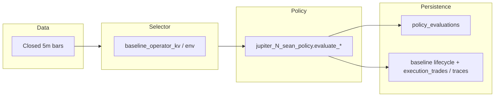
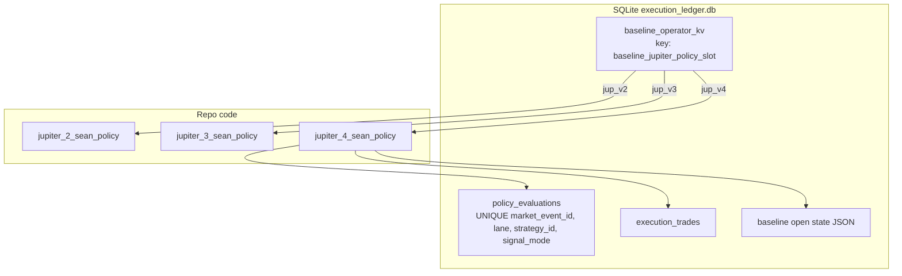

# DV-ARCH-INTAKE-021 — BlackBox Trading Engine: Policy Model, Assignment, Execution, and Quant Research Kitchen V1 Alignment

**Status:** Architecture / alignment reference (not a refactor).  
**Scope:** How **JUPv4** (and the Jupiter baseline family) works **today** in this repo, so Kitchen validation can be mapped to execution without silent drift.

---

## Executive summary

- **Policies are code, not interpreted manifests.** BlackBox does **not** load arbitrary strategy DSL from the dashboard. A “policy” is a **reviewed Python module** (per [`policy_package_standard.md`](policy_package_standard.md)), wired to a **hardened slot** (`jup_v2` / `jup_v3` / `jup_v4`), with optional **Node parity** for specific policies (e.g. JUPv3).
- **One active baseline Jupiter slot** drives evaluation for the **baseline** lane at runtime (operator KV or env). Switching slot is explicit persistence + code paths, not a free-form string.
- **Execution is bar-based and paper-first:** closed **5m** bars, signal on the latest bar, **lifecycle** (SL/TP, breakeven, trail) in shared Python code for baseline opens—not a separate “exchange executor” in this tree for Phase 1-style lab operation.
- **Anti-drift for Kitchen:** parity is **same ordered OHLCV + same evaluator + same lifecycle constants**. Different bar sources or replay ordering will diverge; align on `market_event_id` and feed (`binance_strategy_bars_5m` for JUPv3/JUPv4).

---

## 1. Current policy model (JUPv4)

### 1.1 What “policy” means in code

JUPv4 is implemented as **`modules/anna_training/jupiter_4_sean_policy.py`**. There is **no** standalone JSON/YAML runtime policy blob executed by the engine. Governance states that BlackBox **does not** run unreviewed strings as policy ([`policy_package_standard.md`](policy_package_standard.md)).

**Identity constants** (examples from the module):

| Concept | Example value | Role |
|--------|----------------|------|
| `CATALOG_ID` | `jupiter_4_sean_perps_v1` | Stable catalog / docs id |
| `POLICY_ENGINE_ID` | `jupiter_4` | Engine label in features and bridge |
| `POLICY_SPEC_VERSION` | `1.0` | Spec version string |
| `REFERENCE_SOURCE` | `jupiter_4_sean_policy:v1` | Provenance in features |

**Entry evaluation** returns a **`Jupiter4SeanPolicyResult`** dataclass: `trade: bool`, `side` (`long` / `short` / `flat`), `reason_code`, `pnl_usd` (typically `None` at signal time), `features: dict`.

### 1.2 Signals, indicators, thresholds

- **Inputs:** Ascending list of **closed-bar** dicts (`bars_asc`) with OHLC and volume (`volume_base` or `volume`). Minimum history: `MIN_BARS` (derived from EMA/ATR windows + buffer).
- **Indicators** (conceptual): EMA9/21, RSI(14), ATR(14), volume vs series average, “expected move” style filter—implemented in **`generate_signal_from_ohlc_v4`** and helpers (`ema_series`, `rsi`, etc.).
- **Thresholds** are **module-level constants** (e.g. `RSI_LONG_THRESHOLD`, `RSI_SHORT_THRESHOLD`, `VOLUME_SPIKE_MULTIPLIER`, `MIN_EXPECTED_MOVE`). They are **not** loaded from SQLite at runtime.
- **Gates:** Structured diagnostics include **`jupiter_v4_gates`** (long/short `all_ok` and related fields). Long/short **booleans** feed the decision.
- **Trade decision encoding:**
  - No signal → `trade=False`, `side="flat"`, reason such as `jupiter_4_no_signal`.
  - If **both** long and short gates fire → **short wins** (`precedence: short_over_long` in features).
- **Versioning:** Logical versions appear as **`policy_version`** in features (e.g. `jupiter_4_sean_v1.0`), plus `CATALOG_ID` / `POLICY_ENGINE_ID`. Schema for persisted evaluations uses `policy_evaluations.schema_version` (table default `policy_evaluation_v1`).

### 1.3 Representative `features` keys (non-exhaustive)

When `trade=True`, features typically include diagnostics (EMA, RSI, ATR, volume spike, gates), **`confidence_score`**, **`position_size_hint`** (dict with leverage/risk/collateral/notional per policy math), **`signal_price`**, **`evaluated_bar`** snapshot, **`parity`** string for attribution.

### 1.4 Adapter surface

Downstream code calls **`evaluate_jupiter_4_sean`** or **`evaluate_sean_jupiter_baseline_v4`** in `sean_jupiter_baseline_signal.py`, which normalizes the result for the baseline ledger and dashboard narratives.

---

## 2. Policy assignment mechanics

### 2.1 Single selector: baseline Jupiter slot

**Allowed slots** are fixed in code:

```text
VALID_BASELINE_JUPITER_POLICY_SLOTS = { jup_v2, jup_v3, jup_v4 }
```

(`modules/anna_training/execution_ledger.py`)

**Active slot resolution** (`get_baseline_jupiter_policy_slot`):

1. **`baseline_operator_kv`** row: key **`baseline_jupiter_policy_slot`**, value normalized to `jup_v2` | `jup_v3` | `jup_v4` (aliases like `v4`, `jupiter_4` accepted).
2. Else environment **`BASELINE_JUPITER_POLICY_SLOT`** (same normalization).
3. Else default **`jup_v2`**.

Invalid strings are **ignored** (stderr warning), not silently coerced to a random policy.

**Operator API:** Dashboard **POST** `/api/v1/dashboard/baseline-jupiter-policy` persists the KV (see comments in `execution_ledger.py`).

### 2.2 Where this lives

| Artifact | Location |
|----------|----------|
| Operator selection | SQLite **`execution_ledger.db`** → table **`baseline_operator_kv`** |
| Policy implementations | Repo Python modules under `modules/anna_training/jupiter_*_sean_policy.py` |
| Signal mode string | Mapped from slot: e.g. `jup_v4` → **`sean_jupiter_v4`** (`SIGNAL_MODE_JUPITER_4`) for `policy_evaluations.signal_mode` |

### 2.3 Loading at runtime

Policies are **imported Python modules**. There is no hot-reload of policy code from the DB. Deploy = **git state + API restart** (import cache) when code changes.

### 2.4 Switching and concurrency

- **Switching:** Change KV (or env) → next tick uses the new slot. Open baseline positions are keyed by **`baseline_jupiter_open_position_key`** including **`policy_slot`** so state does not collide between policies.
- **Concurrent policies:** **One** baseline Jupiter implementation runs per tick for the baseline lane, selected by slot. You do **not** run JUPv3 and JUPv4 baseline evaluators in parallel for the same lane; historic rows may still exist for older `signal_mode` values for analytics.

**Anna lane:** `parallel_strategy_runner` uses the **same** active baseline slot to compute the **gating signal**, then fans out to **multiple `strategy_id`s** for Anna paper rows when the signal fires—still one policy math for the signal.

---

## 3. Execution flow (market data → decision → ledger)

### 3.1 High-level pipeline



### 3.2 Frequency and trigger

- **Bar-based:** Evaluation runs on **closed** candles (5m), not tick streaming inside this path.
- **Trigger:** After canonical / Binance-strategy bar refresh (e.g. `run_baseline_ledger_bridge_tick` from ingest when `BASELINE_LEDGER_AFTER_CANONICAL_BAR` is on). Effectively **event-driven per new closed bar** when the bridge is enabled.

### 3.3 Modules (baseline)

| Step | Module / function |
|------|-------------------|
| Bar fetch | `market_data.bar_lookup` — `fetch_recent_bars_asc_binance_strategy` for JUPv3/JUPv4 |
| Identity check | `baseline_ledger_bridge.verify_market_event_id_matches_canonical_bar` |
| Signal | `evaluate_sean_jupiter_baseline_v4` (or v3/v1 by slot) |
| Policy log | `upsert_policy_evaluation` → **`policy_evaluations`** (including `trade=false`) |
| Lifecycle | `jupiter_2_baseline_lifecycle` — open, hold, exit with SL/TP rules |
| Trades / traces | `execution_ledger`, `decision_trace`, position events |

### 3.4 Final decision order

1. **Insufficient data / parse errors** → no trade, logged reasons.
2. **Flat** → no trade; evaluation row still written when logging is on.
3. **Signal true** → **entry** at **bar close** via `open_position_from_signal` (ATR from Jupiter_2 helper for lifecycle SL/TP initialization).
4. **Holding** → `process_holding_bar`; exits **deterministic** intrabar priority (SL vs TP documented in lifecycle: both touched → SL wins).

---

## 4. Risk and execution layer

### 4.1 Position sizing (baseline)

- **JUPv4** computes **`position_size_hint`** inside policy (`calculate_position_size_v4` + confidence), using **free collateral** from `resolve_free_collateral_usd_for_jupiter_policy` when not explicitly passed.
- **Lifecycle open** uses **`baseline_lifecycle_base_size_from_signal_features`** (via `open_position_from_signal`) to turn hints into **`BaselineOpenPosition.size`** and metadata (`size_source`, notional, leverage fields when present).

### 4.2 Stop-loss / take-profit

- **Not embedded in JUPv4 entry gates.** After entry, **shared** lifecycle constants apply: `SL_ATR_MULT`, `TP_ATR_MULT`, breakeven, monotonic trailing (`jupiter_2_baseline_lifecycle.py`). Initial SL/TP are derived from **ATR at entry** and side.
- **Comment in bridge:** JUPv3/JUPv4 use Jupiter_2 lifecycle until a v3-specific lifecycle exists—so **exit mechanics are a shared engine layer**, not per-policy Python files today.

### 4.3 Risk rules

- Policy constants cap risk bands (`BASE_RISK_PCT`, `MAX_RISK_PCT`, etc. in JUPv4).
- **Enforcement split:** entry **intent** and sizing hints come from policy features; **virtual** SL/TP/trail behavior comes from **lifecycle** module. There is no separate “risk service” table driving baseline in this description.

### 4.4 Anna parallel harness

For **`persist_parallel_anna_paper_trade_with_trace`**, PnL is computed with **size 1.0** and open→close on the bar for paper comparison—**intentionally simplified** vs full baseline sizing (see `decision_trace.py` docstring). Signal gating still follows the **same** baseline policy evaluation as the active slot.

---

## 5. Determinism and consistency

### 5.1 Deterministic evaluation

Given **identical** `bars_asc` (same order, same numeric OHLCV), the **same** Python code path is **deterministic** for signal generation (pure float math; no `random`, no wall-clock in the core evaluator).

### 5.2 Timing dependencies

- Signals are defined on **closed** bars; **no intrabar** policy signal in the JUPv4 module described here.
- **Clock / ingest latency** affects **which** bar is “latest” when the bridge runs, not the math on a fixed series.

### 5.3 Research vs “live” baseline

| Risk | Mitigation |
|------|------------|
| **Different bar source** | JUPv3/JUPv4 require **`binance_strategy_bars_5m`** alignment; compare with same `market_event_id` |
| **Different history length** | `MIN_BARS` gate; insufficient history → no signal |
| **Replay runner vs production ingest** | Must feed the **same** schema fields the evaluator parses (`open`/`high`/`low`/`close`, volume keys) |
| **Policy code version drift** | Git revision + `catalog_id` / `parity` / `policy_version` in features |

Canonical cross-system narrative for JUPv3 alignment: [`JUPv3.md`](JUPv3.md) (same ideas extend to JUPv4 with updated slot/catalog).

---

## 6. Standardized policy builder (recent work)

### 6.1 `policy_package_standard.md`

Defines a **repeatable package** for new Jupiter baselines:

- **`POLICY_SPEC.yaml`** — machine-readable identity: `policy.id`, `baseline_policy_slot`, **`signal_mode`**, `catalog_id`, `timeframe`, `inputs`, `constants` summary, `gates` description, optional **`parity`** paths.
- **Deliverables:** Python module, optional `.mjs` mirror, **`INTEGRATION_CHECKLIST.md`**, fixtures, **`scripts/validate_policy_package.py`** for structural validation.
- **Grok prompt depth:** [`jupv4_grok_implementation_prompt.md`](jupv4_grok_implementation_prompt.md).

### 6.2 Guarantees and constraints

- **Hardened slots** — new policies extend **`VALID_BASELINE_JUPITER_POLICY_SLOTS`** and wiring; no silent strings.
- **`signal_mode`** must match ledger naming.
- **Preferred integration surface:** OHLC as lists / bar dicts—not pandas-only APIs unless explicitly adapted.
- **Future note:** declarative YAML + small interpreter for **parameter-only** policies would reduce LLM breakage; full flexibility stays in **reviewed code**.

### 6.3 Versus “upload and run”

The standard **explicitly rejects** executing unreviewed policy strings from the UI. Kitchen → BlackBox promotion must land as **merged code + tests + slot wiring**, not a dynamic blob.

---

## 7. Mapping considerations (Kitchen → BlackBox)

### 7.1 Hard to express as a portable “policy file” today

- **Anything** requiring new indicators, gate topology, or precedence rules → **new or extended Python (and optional TS)**, plus tests.
- **Lifecycle behavior** (SL/TP/trail) is **shared** across Jupiter baselines in Python; changing exits is **not** isolated to a single policy module unless extended deliberately.

### 7.2 Implicit / hardcoded engine behavior

- **Short-over-long** tie-break (JUPv4).
- **Lifecycle** ATR multipliers and breakeven threshold (`jupiter_2_baseline_lifecycle.py`).
- **Collateral resolution** path for paper (`jupiter_2_paper_collateral` / training state / ledger).
- **Single active baseline slot** for signal fan-out.

### 7.3 What blocks clean manifest → policy translation

| Blocker | Detail |
|---------|--------|
| No DSL executor | Manifest must compile to **reviewed** code or a **future** declarative interpreter with a fixed schema |
| Bar alignment | Kitchen replay must use the **same** feed semantics as `binance_strategy_bars_5m` (or explicit adapter) |
| Lifecycle coupling | Validated PnL in research must use the **same** exit rules as `jupiter_2_baseline_lifecycle` or document deltas |
| Anna vs baseline | Parallel Anna paper uses simplified sizing for some paths; not interchangeable with baseline PnL without code changes |

---

## 8. Target state (stated intent vs current)

**Intent:** One manifest → one policy → identical BlackBox execution.

**Current reality:** One **reviewed policy package** → Python (± TS parity) → **slot** → shared lifecycle → SQLite ledger. **Alignment** is achieved by **shared code, shared bars, and tests**, not by loading the manifest at runtime.

**Team consensus (product target, separate from as-is code):** Template → filled policy → validated artifact → load → **apply only on the next closed evaluation boundary**, with explicit **activation semantics** and **lineage** so the dashboard does not mis-attribute policy to trades. See **[`policy_activation_lineage_spec.md`](policy_activation_lineage_spec.md)** (authoring vs assignment; pending/active; gap vs today’s KV-only slot switch).

**Recommended Kitchen integration path (engineering):**

1. Emit **`POLICY_SPEC.yaml` + fixtures** compatible with [`policy_package_standard.md`](policy_package_standard.md).
2. Prove **golden-vector parity**: same bars → same `trade` / `side` / key diagnostics as `policy_evaluations.features_json`.
3. Pin **`market_event_id`** and bar source for any comparative report.
4. Extend **`VALID_BASELINE_JUPITER_POLICY_SLOTS`** only when a new baseline is ready—avoid overloading one slot with incompatible semantics.

---

## 9. Diagram: slots, signal modes, and storage



---

## 10. References (in-repo)

| Topic | Path |
|------|------|
| Policy package contract | [`policy_package_standard.md`](policy_package_standard.md) |
| JUPv3 alignment narrative | [`JUPv3.md`](JUPv3.md) |
| JUPv4 Grok / documentation prompt | [`jupv4_grok_implementation_prompt.md`](jupv4_grok_implementation_prompt.md) |
| Slot + signal modes | `modules/anna_training/execution_ledger.py` |
| Baseline bridge | `modules/anna_training/baseline_ledger_bridge.py` |
| JUPv4 policy | `modules/anna_training/jupiter_4_sean_policy.py` |
| Lifecycle | `modules/anna_training/jupiter_2_baseline_lifecycle.py` |
| Parallel Anna | `modules/anna_training/parallel_strategy_runner.py` |
| Policy evaluations schema | `data/sqlite/schema_policy_evaluation.sql` |

---

*Document generated for DV-ARCH-INTAKE-021. Code paths described reflect the repository at authoring time; verify line-level details against current `main` when implementing Kitchen integration.*
