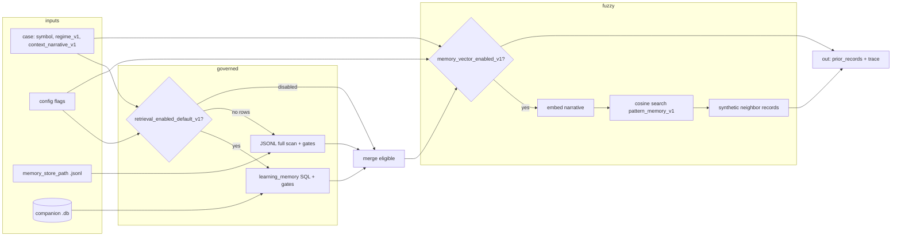

# FINQUANT_UNIFIED_AGENT_LAB_ARCHITECTURE_001

**To:** Engineering  
**Cc:** Operator / Architect  
**Re:** Create isolated FinQuant Unified Agent Lab architecture and folder structure  
**Status:** Architecture directive — first document for isolated FinQuant unified-agent work

---

## 1. Purpose

We are creating an isolated FinQuant Unified Agent Lab under the FinQuant subproject.

This lab exists to prove that FinQuant can operate as a trader-agent before it is plugged back into the main application.

The goal is not to extend the current web application, UI, Student test isolation path, dashboard, Flask route, or parallel batch runtime.

The goal is to create a clean, standalone place where FinQuant can be tested as an agent that understands when to punch in, when to stay out, when to hold, and when to punch out.

FinQuant must be validated outside the app first so we can separate agent intelligence from application plumbing.

---

## 2. Core principle

The application is not the agent.

The application is the host, UI, operator surface, and integration layer.

FinQuant is the agent.

The LLM is a governed reasoning component inside FinQuant.

The Unified Agent Lab is where we prove the FinQuant agent works before wiring it back into the application.

---

## 3. Required isolation boundary

Engineering must keep this work separate from existing project code.

Do not mix this work into:

- existing UI code
- Flask API routes
- dashboard code
- current Student seam runtime
- current replay runner
- existing scorecard wiring
- existing operator batch code
- production runtime paths

This lab must be self-contained under:

```text
finquant/unified/agent_lab/
```

The lab may read reusable schemas or contracts later if explicitly approved, but the first implementation must not depend on the application being live.

No service restart should be required to run the lab.

No web app should be required to run the lab.

No dashboard should be required to inspect the first outputs.

---

## 4. Required folder structure

Engineering must create the following folder structure exactly:

```text
finquant/
  unified/
    README.md
    agent_lab/
      README.md
      runner.py
      case_loader.py
      lifecycle_engine.py
      decision_contracts.py
      evaluation.py
      memory_store.py
      retrieval.py
      schemas/
        finquant_lifecycle_case_v1.schema.json
        finquant_decision_v1.schema.json
        finquant_learning_record_v1.schema.json
      cases/
        README.md
        lifecycle_basic_v1.json
        trend_entry_exit_v1.json
        chop_no_trade_v1.json
        false_breakout_exit_v1.json
      configs/
        agent_lab_config_v1.json
      outputs/
        .gitkeep
      docs/
        architecture_notes.md
```

If any existing folder already exists, do not delete it. Add only the missing folders and files.

---

## 5. What this lab must prove

The first purpose of this lab is to prove FinQuant can complete a trade lifecycle outside the app.

A trade lifecycle means:

```text
observe candle context
→ interpret market state
→ decide NO_TRADE or ENTER
→ if entered, evaluate each new candle
→ decide HOLD or EXIT
→ close the lifecycle
→ grade outcome
→ write learning record
→ retrieve eligible prior records in a later run
```

This is the actual FinQuant trader bar.

A single flash-card answer is not enough.

FinQuant must reason over time.

---

## 6. Agent actions

The lifecycle engine must support these actions:

```text
NO_TRADE
ENTER_LONG
ENTER_SHORT
HOLD
EXIT
```

Each action must include structured reasoning.

Minimum decision fields:

```json
{
  "schema": "finquant_decision_v1",
  "agent_id": "finquant",
  "case_id": "string",
  "step_index": 0,
  "symbol": "string",
  "action": "NO_TRADE | ENTER_LONG | ENTER_SHORT | HOLD | EXIT",
  "thesis": "string",
  "invalidation": "string",
  "confidence_band": "low | medium | high",
  "supporting_indicators": [],
  "conflicting_indicators": [],
  "risk_notes": "string",
  "memory_used_v1": [],
  "llm_used_v1": false,
  "decision_source_v1": "rule | llm | hybrid",
  "causal_context_only_v1": true
}
```

---

## 7. Learning model

FinQuant must learn from lifecycle events, not isolated answers.

The learning model must capture:

- entry quality
- no-trade quality
- hold quality
- exit quality
- missed opportunity
- premature exit
- late exit
- thesis failure
- invalidation failure
- indicator misuse
- regime misread
- risk/reward failure

The learning record must be durable JSONL.

Minimum learning record fields:

```json
{
  "schema": "finquant_learning_record_v1",
  "agent_id": "finquant",
  "case_id": "string",
  "record_id": "string",
  "symbol": "string",
  "timeframe": "string",
  "decision_trace_ref": "string",
  "entry_action_v1": "NO_TRADE | ENTER_LONG | ENTER_SHORT",
  "exit_action_v1": "EXIT | NONE",
  "outcome_v1": {},
  "grade_v1": {},
  "lesson_v1": "string",
  "failure_modes_v1": [],
  "learning_governance_v1": {
    "decision": "HOLD | PROMOTE | REJECT",
    "reason_codes": []
  },
  "stored_v1": true,
  "promotion_eligible_v1": false,
  "retrieval_enabled_v1": false,
  "causal_integrity_v1": true
}
```

Important rule:

Store and promotion are separate.

Rejected learning records may be stored, but they must not be retrievable unless governance explicitly enables retrieval.

---

## 8. LLM role inside FinQuant

The LLM is not the agent.

The LLM is a governed reasoning organ inside FinQuant.

The lab must preserve this boundary:

```text
FinQuant owns identity.
FinQuant owns the decision contract.
FinQuant owns memory.
FinQuant owns learning records.
FinQuant owns governance flags.
The LLM may provide reasoning, but it does not directly write memory or policy.
```

All LLM output must be converted into `finquant_decision_v1` before it is treated as an agent decision.

No raw LLM output is authoritative by itself.

---

## 9. Crypto knowledge base assumption

FinQuant may have baked-in crypto/perps knowledge.

This lab assumes FinQuant should understand:

- candle structure
- trend vs chop
- support/resistance behavior
- RSI
- EMA
- ATR
- volatility expansion/contraction
- risk/reward
- stop/invalidation logic
- perps funding concepts
- liquidation risk concepts
- no-trade discipline

However, baked-in knowledge is not enough.

The lab must prove FinQuant can apply that knowledge to lifecycle decisions over time.

---

## 10. Required case types

The first case pack must include at least these scenarios:

### lifecycle_basic_v1.json
A simple lifecycle where FinQuant must make one entry or no-trade decision and then process the outcome.

### trend_entry_exit_v1.json
A trend continuation case where FinQuant should identify a reasonable punch-in point and a reasonable punch-out condition.

### chop_no_trade_v1.json
A choppy market case where the correct behavior is likely stand down or avoid forced entry.

### false_breakout_exit_v1.json
A false breakout case where FinQuant must identify that the thesis failed and punch out.

Each case must hide future candles from the decision step.

Future candles may only be revealed one step at a time by the lifecycle engine.

---

## 11. Required outputs

Each lab run must write outputs under:

```text
finquant/unified/agent_lab/outputs/<run_id>/
```

Required artifacts:

```text
decision_trace.jsonl
learning_records.jsonl
retrieval_trace.jsonl
evaluation_summary.json
leakage_audit.json
run_manifest.json
```

The run must be inspectable without the app.

---

## 12. First runner behavior

The initial runner command should be:

```bash
python finquant/unified/agent_lab/runner.py \
  --case-pack finquant/unified/agent_lab/cases/lifecycle_basic_v1.json \
  --config finquant/unified/agent_lab/configs/agent_lab_config_v1.json \
  --output-dir finquant/unified/agent_lab/outputs
```

The runner must print clear progress to the terminal:

- loaded config
- loaded cases
- started lifecycle case
- decision emitted
- outcome graded
- learning record written
- output paths written
- final PASS/FAIL summary

---

## 13. First acceptance bar

The first acceptance bar is not profitability.

The first acceptance bar is agent lifecycle closure.

A passing first proof must show:

```text
cases_loaded > 0
decisions_emitted > 0
learning_records_written == cases_processed
leakage_audit.pass == true
outputs_written == true
```

If a case has multiple lifecycle steps, the run must also show:

```text
step_decisions_emitted > 0
final_action_resolved == true
```

---

## 14. What not to optimize yet

Do not optimize win rate yet.

Do not compare against baseline yet.

Do not wire this into the web app yet.

Do not add dashboard surfaces yet.

Do not add automatic trading yet.

Do not add complex memory promotion yet.

First prove the standalone agent loop closes.

---

## 15. Final integration intent

Once FinQuant passes the standalone agent lab, the application should consume FinQuant as a proven agent component.

The app should not be the place where we discover whether the agent works.

The long-term path is:

```text
build FinQuant in isolated lab
→ prove lifecycle trading behavior
→ prove learning record write
→ prove retrieval/reuse
→ prove behavior delta
→ then plug FinQuant back into the application
```

---

## 16. Engineering execution instructions

Engineering must first create the folder structure and placeholder files listed in section 4.

Do not implement the full agent yet.

First deliver:

- folder structure exists
- README files explain isolation boundary
- schemas are placeholder but valid JSON schema files
- cases are placeholder but valid JSON files
- runner.py exists and prints a clear “lab scaffold ready” message
- no app imports are introduced

Then commit locally and sync the remote.

Return proof showing:

```text
find finquant/unified/agent_lab -maxdepth 4 -type f | sort
python finquant/unified/agent_lab/runner.py --help
python finquant/unified/agent_lab/runner.py --scaffold-check
```

The scaffold proof must run without Flask, without the web app, and without services being restarted.

---

## 17. One-line instruction

Create an isolated FinQuant Unified Agent Lab under `finquant/unified/agent_lab/` so we can prove the agent can learn punch-in / punch-out lifecycle behavior before plugging it back into the application.

---

## 18. RMv2 memory architecture — governed learning + tiered pattern memory (2026)

This section normatively describes the **Reasoning Module v2 (RMv2)** memory stack as implemented under the learning-engineering tree. Canonical workspace today:

```text
prove_learning/finquant/unified/agent_lab/
  rmv2/
    engine.py          # LangGraph pipeline; retrieval node builds narrative query
    memory_index.py    # SQLite schema: learning_memory, context_snapshots, pattern_memory_v1
    memory_tiers.py    # STM insert, LTM promotion, cosine search, TTL prune
    embeddings.py      # Ollama /api/embed (+ legacy /api/embeddings), deterministic fallback
  retrieval.py         # Single public retrieval API: retrieve_eligible
  memory_store.py      # Run artifacts + append JSONL + dual-write learning rows to SQLite
```

Older references in this document to `finquant/unified/agent_lab/` without `prove_learning/` should be read as **repository-relative path drift**; the normative lab root for blackbox is `prove_learning/finquant/unified/agent_lab/`.

### 18.1 Design goals

1. **Audit spine** — Append-only JSONL for governed learning records remains the human-inspectable source of truth for promotion governance.
2. **Indexed read path** — Companion SQLite (`*.jsonl` → sibling `*.db`) accelerates retrieval and holds structured rows without replacing JSONL.
3. **Exact vs fuzzy recall** — **Governed memory** answers “what passed quality gates?” **Pattern memory (STM/LTM)** answers “what situations felt like this before?” using **embedding similarity** (probabilistic).
4. **Single retrieval API** — All callers use `retrieval.retrieve_eligible` only (no parallel retrieval entry points).
5. **Resilience** — Semantic embeddings preferred in production; **deterministic fallback** if Ollama is unreachable so loops keep running with weaker geometry.

### 18.2 Storage pairing (one rule)

- Config key `memory_store_path` MUST point to a path ending in `.jsonl` when companion DB features are required.
- **Companion DB path** is always `same_basename.db` (see `retrieval.companion_memory_sqlite_path`).
- There is **no** separate `memory_sqlite_path_v1` override; one pairing rule reduces drift.

### 18.3 SQLite tables (companion DB)

| Table | Purpose |
|--------|---------|
| `learning_memory` | Governed learning records mirrored from JSONL (full `record_json`, indexed columns for gates). |
| `pattern_memory_v1` | **STM/LTM** rows: narrative text, float **embedding blob**, tier, regime/symbol/timestamps, optional `outcome_hint`, TTL for STM. |
| `context_snapshots` | Optional audit rows for immutable context packets (replay / training exports); not required for hot path. |

### 18.4 Retrieval pipeline (`retrieve_eligible`)



**Order of operations:**

1. If `memory_store_path` is missing → trace `no_memory_store_path`; still attempt vector merge only if DB path cannot resolve (usually nothing happens).
2. **Governed retrieval** (optional): if `retrieval_enabled_default_v1`, prefer `learning_memory` when non-empty; else scan JSONL with the same quality gates (min obs, min win rate, status, regime match rules).
3. **Vector merge** (optional): if `memory_vector_enabled_v1` and `context_narrative_v1` non-empty and DB file exists → prune expired STM → embed narrative → cosine retrieve top STM + top LTM → append bounded synthetic records (`memory_vector_max_extra_v1`).

Synthetic neighbors are shaped like learning records for prompt formatting but carry `memory_source_v1` / `pattern_similarity_v1` / `pattern_status_v1: vector_probe_v1` so auditors can distinguish **fuzzy** hits from **promoted** lessons.

### 18.5 RMv2 graph integration

RMv2 (`rmv2/engine.py`) runs:

`feature_extraction` → `quality_retrieval` → `tot_reasoning` → `guard_rails`

**`quality_retrieval`** builds **`context_narrative_v1`** via `context_builder.build_rich_context` (trajectory / regime / divergence-style summary), passes it into `retrieve_eligible`, and stores the same string on graph state and on **`RMDecision.context_narrative_v1`** for downstream logging (e.g. live STM insert).

### 18.6 STM vs LTM semantics

| Tier | Meaning | Lifetime |
|------|---------|----------|
| **STM** | “I just saw this kind of market story.” | Rows carry `expires_stm_at` (default **168h** in production config); pruned on retrieval and live loop. |
| **LTM** | “This kind of story got an outcome label.” | Promoted from STM when the live loop completes falsification (`promote_stm_to_ltm`), `outcome_hint` set from falsifier outcome. |

This mirrors human recall: **recent vivid episodes** plus **longer-lived labeled experience**.

### 18.7 Embeddings — production and fallback

Configuration (`configs/default_lab_config.json` and RMConfig):

| Key | Role |
|-----|------|
| `memory_embedding_backend_v1` | `ollama` (semantic) or `deterministic` (hash projection). |
| `ollama_base_url_v1` | Same host as chat LLM unless deliberately split. |
| `ollama_embeddings_model_v1` | e.g. `nomic-embed-text`. |
| `memory_embedding_fallback_v1` | If true and Ollama fails → deterministic embedding (label `deterministic_fallback`). |
| `memory_embedding_dim_v1` | Dimension for **deterministic** path; Ollama vectors use model-native dimension (stored per row in `embedding_dim`). |

Implementation detail (`rmv2/embeddings.py`):

- Calls **`POST /api/embed`** with `{ "model", "input", "truncate": true }` and reads `embeddings[0]`.
- Falls back to **`POST /api/embeddings`** with `{ "model", "prompt" }` and reads `embedding` for older Ollama builds.

**Operator prerequisite on embed host:** `ollama pull <ollama_embeddings_model_v1>`.

### 18.8 Live forward loop hooks (`live_forward_test.py`)

- Uses **`lab_config_path`** so production JSON drives RMConfig (vectors + LLM).
- **Prune** expired STM each bar (via `companion_memory_sqlite_path` + `prune_expired_stm`).
- After each decision: **`insert_stm`** when vectors enabled (stores narrative + embedding).
- After falsification: **`promote_stm_to_ltm`** using `vector_memory_id_v1` captured on the decision record.

### 18.9 Relationship to FinQuant LLM training

- Runtime RMv2 feeds **retrieved packets** (governed + synthetic similarity) into Qwen prompts.
- The dedicated FinQuant fine-tune pipeline consumes **exported** examples (`finquant_agentic_qa_v1` schema); alignment is by **field contracts** (`retrieved_memory_v1`, narratives, risk JSON), not by direct DB reads from the training cluster.

### 18.10 Strength / risk posture

- **Strength:** Semantic neighborhoods improve “have I seen something like this?” without requiring identical historical bars.
- **Risk:** Similarity is **not proof**; governed gates and falsification remain the integrity backbone. Vector hits should be treated as **context**, not automatic promotion.

---

## 19. Document history

| Date | Change |
|------|--------|
| 2026-05-04 | Added §18–§19: RMv2 companion DB, STM/LTM pattern memory, Ollama embeddings, single `retrieve_eligible` contract, live hooks, training boundary note. |
