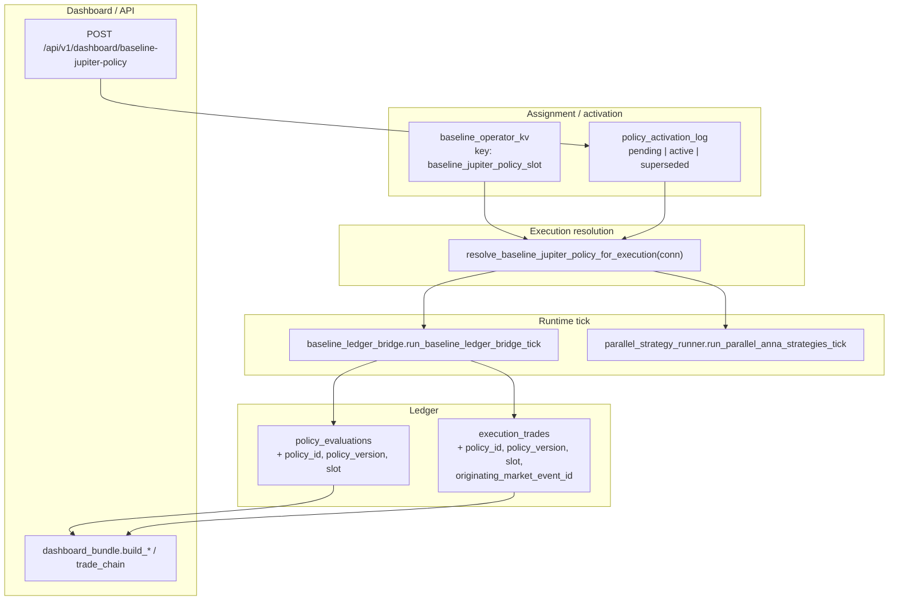

# Policy wiring surface map (v1)

**Directive:** DV-ARCH-CLARIFICATION-029 — Policy Wiring Clarification — Source of Truth Across All Surfaces  
**Status:** Documentation only (no code changes in this step).  
**Scope:** **Baseline Jupiter** policies (`jup_v2` / `jup_v3` / `jup_v4`) — the integrated Sean evaluators in `modules/anna_training/jupiter_*_sean_policy.py`. Custom policy **ingestion** (024-C) will plug into the same surfaces once implemented; this map is the checklist so nothing is missed.

**Related:** [`blackbox_policy_kitchen_integration_writeup.md`](blackbox_policy_kitchen_integration_writeup.md), [`policy_activation_lineage_spec.md`](policy_activation_lineage_spec.md), [`DV-ARCH-POLICY-LOAD-028_unified_policy_submission.md`](DV-ARCH-POLICY-LOAD-028_unified_policy_submission.md).

---

## Executive diagram (data flow)



---

## 3.1 Assignment surface

### Where selection is written

| Mechanism | Function(s) | Storage |
|-----------|---------------|---------|
| Operator / tests (full path) | `set_baseline_jupiter_policy_slot(conn, policy_slot, assigned_by=...)` in `modules/anna_training/execution_ledger.py` | Updates **`baseline_operator_kv`** (key `baseline_jupiter_policy_slot`) **and**, when `policy_activation_log` exists, calls **`enqueue_baseline_jupiter_policy_activation`** with canonical `policy_id` / `policy_version` from **`baseline_jupiter_policy_lineage(ps)`**. |
| Dashboard API (current) | `POST /api/v1/dashboard/baseline-jupiter-policy` in `UIUX.Web/api_server.py` | Does **not** call `set_baseline_jupiter_policy_slot` directly. Parses body and calls **`enqueue_baseline_jupiter_policy_activation`** only (legacy `policy_slot` path maps slot → lineage then enqueues). **KV is updated when activation applies**, inside **`apply_baseline_jupiter_policy_activation_at_bar`** (see §3.2). |
| Environment | `BASELINE_JUPITER_POLICY_SLOT` | Read only by **`_legacy_baseline_jupiter_policy_slot_from_kv_env`** if KV missing/invalid. |

### Pending vs active

| State | Table | Meaning |
|-------|--------|---------|
| **Pending** | `policy_activation_log` row with `activation_state = 'pending'` | Target policy queued; **`previous_baseline_policy_slot`** holds the execution-effective slot at enqueue time. |
| **Active** | `policy_activation_log` row with `activation_state = 'active'` | Lineage on this row defines the “activated” policy for resolution. |
| **Superseded** | Older rows | Historical; ignored for resolution. |

Schema: `data/sqlite/schema_policy_activation.sql` (DV-ARCH-023-A).

### How `policy_id` / `policy_version` are introduced

- **`baseline_jupiter_policy_lineage(policy_slot)`** returns `(catalog_id, policy_engine_id)` imported from the active Jupiter module (e.g. `jupiter_4_sean_policy.CATALOG_ID`, `POLICY_ENGINE_ID`).
- **`baseline_slot_from_policy_lineage(policy_id, policy_version)`** maps stored ids back to `jup_v2` | `jup_v3` | `jup_v4`.
- Enqueue path canonicalizes unknown pairs via **`baseline_slot_from_policy_lineage`** before insert.

### Operator-visible “selection” without execution (pending)

- **`get_baseline_jupiter_policy_slot(conn)`** — reads **KV/env only** (immediate operator selection). Docstring: use **`resolve_baseline_jupiter_policy_for_execution`** for evaluators.
- **`pending_baseline_jupiter_target_slot(conn)`** — target slot from **pending** row’s lineage, if any.

---

## 3.2 Execution resolution surface

### Single function for “what policy runs this tick”

**`resolve_baseline_jupiter_policy_for_execution(conn: sqlite3.Connection) -> str`**

`modules/anna_training/execution_ledger.py`

Resolution order (simplified):

1. If **`policy_activation_log` missing or empty** → same as legacy: **`_legacy_baseline_jupiter_policy_slot_from_kv_env`** (KV then env then default `jup_v2`).
2. If an **`active`** row exists → map **`policy_id` / `policy_version`** → slot via **`baseline_slot_from_policy_lineage`**.
3. If only **`pending`** exists → use **`previous_baseline_policy_slot`** from that pending row (execution stays on prior slot until boundary).
4. Fallback → legacy KV/env.

### Pending is not ignored — it defers the switch

- Evaluator + bridge use **`resolve_baseline_jupiter_policy_for_execution`**, so **pending does not switch the evaluator** until activation fires; **`previous_baseline_policy_slot`** keeps execution on the old slot.

### Activation boundary enforcement

**`apply_baseline_jupiter_policy_activation_at_bar(conn, market_event_id=..., candle_open_utc=...)`**

- Called at the **start** of **`run_baseline_ledger_bridge_tick`** in `baseline_ledger_bridge.py` **after** fetching the bar, **before** resolving the slot for signal evaluation.
- Compares closed-bar open time to **`next_pending_activation_effective_on_iso(created_at_utc)`** (first 5m boundary after enqueue). When eligible, marks pending **active**, supersedes prior active, **writes `baseline_operator_kv`** to the new slot.

### Other callers of execution resolution

| Module | Function | Uses |
|--------|----------|------|
| `baseline_ledger_bridge.py` | After `apply_baseline_jupiter_policy_activation_at_bar`, uses `resolve_...` for `policy_slot` driving evaluator + `signal_mode`. | Same |
| `parallel_strategy_runner.py` | `resolve_baseline_jupiter_policy_for_execution` for Anna gating signal | Same |
| `lookup_baseline_jupiter_open_state_json` | `resolve_baseline_jupiter_policy_for_execution` for position key | Same |

---

## 3.3 Ledger / lifecycle surface

### `policy_evaluations`

**Writer:** **`upsert_policy_evaluation`** in `execution_ledger.py` (DV-ARCH-023-B lineage columns).

**Call site (baseline tick):** `baseline_ledger_bridge._log_eval` → passes:

- `policy_id=policy_id_lineage`
- `policy_version=policy_version_lineage`
- `slot=POLICY_ACTIVATION_SLOT_BASELINE_JUPITER` (`"baseline_jupiter"`)

Per-bar identity also includes **`signal_mode`** (derived from slot via **`signal_mode_for_baseline_policy_slot`**) and **`features_json`** (evaluator diagnostics; includes `catalog_id`, `policy_engine`, `parity`, etc.).

**Unique key:** `(market_event_id, lane, strategy_id, signal_mode)` — switching engines can produce multiple rows per bar in theory; fetch logic prefers v4 > v3 > v2 when **`prefer_active_slot=False`**.

### `execution_trades` and lifecycle

**Lifecycle close path:** `persist_baseline_lifecycle_close` in `decision_trace.py` (called from `baseline_ledger_bridge` on exit) passes **`policy_id`**, **`policy_version`**, **`lineage_slot`**, **`originating_market_event_id=str(pos.entry_market_event_id)`** — entry bar id for the opening decision.

**`append_execution_trade`** in `execution_ledger.py` persists lineage columns and **`originating_market_event_id`** when provided.

### Lifecycle does not recompute policy identity

- **`jupiter_2_baseline_lifecycle`** (`process_holding_bar`, `open_position_from_signal`) operates on **`BaselineOpenPosition`** and OHLC; it does **not** pick Jupiter v2 vs v3 vs v4.
- Policy “identity” for the open is frozen in **`signal_features_snapshot`** / entry snapshot on the position and in **`policy_evaluations`** on the entry **`market_event_id`**.

---

## 3.4 Dashboard surface

### Bundle: `build_jupiter_policy_snapshot` (`dashboard_bundle.py`)

| Field | Source | Meaning |
|-------|--------|---------|
| `baseline_jupiter_policy.active_id` | **`resolve_baseline_jupiter_policy_for_execution`** | **Execution-effective** slot for labels/chips tied to “what runs.” |
| `baseline_jupiter_policy.active_label` | **`baseline_jupiter_policy_label_for_slot(exec_slot)`** | JUPv2 / JUPv3 / JUPv4 |
| `baseline_jupiter_policy_slot` | **`baseline_jupiter_policy_slot_for_market_data(conn)`** | **Pending-aware** bar alignment: if a **pending** activation exists, returns **target** slot so **fetch** uses Binance vs Pyth consistently with the queued policy; else same as execution-effective. |

So: **preview / bar fetch** may follow **pending** target; **active_id** in the same object is still **execution-effective** — operators should not conflate the two without reading both fields.

### Trade rows / strips: `baseline_jupiter_policy_tag_for_execution_trade`

`modules/anna_training/dashboard_bundle.py`

- Uses **`fetch_baseline_policy_evaluation_for_market_event(..., prefer_active_slot=False)`** on **entry** and **exit** `market_event_id`s.
- **`prefer_active_slot=False`** forces **v4 → v3 → v2** per bar so **historic** rows are **not** relabeled by the operator’s **current** slot (explicitly documented in the function — avoids “all trades look JUPv4”).
- Fallback: **`context_snapshot_json.signal_mode`**, **`signal_features_snapshot`** authority (`entry_policy_authority_from_signal_features`).

### Tile / cell labeling (event axis)

- Per-column tags use **persisted** `policy_evaluations` for that **`market_event_id`**, not the live selector (see comments in `dashboard_bundle` around trade chain / baseline cells).

### API snapshot for operator (pending / effective-on)

**`baseline_jupiter_policy_activation_api_snapshot(conn)`** — drives **`POST /api/v1/dashboard/baseline-jupiter-policy`** response: `current_active_policy`, `pending_policy`, `effective_on`, `effective_baseline_policy_slot`.

---

## 3.5 API surface

### Routes that **change** policy activation state

| Route | Method | Behavior |
|-------|--------|----------|
| `/api/v1/dashboard/baseline-jupiter-policy` | **POST** | Enqueues **`enqueue_baseline_jupiter_policy_activation`** (pending). Comment in code: **not** a Kitchen bypass; built-in slots only. Body: either `policy_id` + `policy_version` + `slot`, or legacy `policy_slot` / `id`. |

No other route in `api_server.py` was found that writes **`baseline_operator_kv`** or **`policy_activation_log`** for Jupiter baseline.

### Routes that **read** policy-related state (representative)

| Route | What it exposes |
|-------|-----------------|
| `/api/v1/dashboard/bundle` | Full dashboard payload including **`baseline_jupiter_policy`**, snapshots, trade chains — built via `dashboard_bundle`. |
| `/api/v1/dashboard/baseline-trades-report` | Baseline trades + tags. |
| `/api/v1/dashboard/baseline-active-position` | Open baseline position. |
| `/api/v1/dashboard/baseline-chain-validate` | Chain validation (policy axis vs bars). |
| `/api/v1/anna/training-dashboard`, `/api/v1/anna/evaluation-summary`, etc. | May include policy context via bundle helpers where wired. |

### Kitchen / research (not the same as live slot assignment)

- **`/api/v1/renaissance/*`** (experiments, jobs, workbench, baseline export) — **Renaissance / Kitchen-style** research flows; they do **not** replace **`policy_activation_log`** for live baseline slot. Ingestion 024-C should **feed** the same activation pipeline rather than a parallel “shadow” slot.

---

## 3.6 Historical attribution

### Stored vs recomputed

- **Historical** policy for a bar is **`policy_evaluations.signal_mode`** + **`policy_id` / `policy_version` / `slot`** columns for that **`market_event_id`** (and lane/strategy).
- **Trade strips** intentionally use **`prefer_active_slot=False`** when resolving labels so **current slot does not overwrite** past events.
- **Lifecycle closes** attach **`originating_market_event_id`** to tie PnL rows to the **entry** decision bar.

### Confirmation: no path should relabel history from “current slot only”

- **`baseline_jupiter_policy_tag_for_execution_trade`** is designed to **avoid** the failure mode where exit **`market_event_id`** + active slot would label everything as the latest policy.

---

## 3.7 Source-of-truth rules (explicit)

| Concern | Source of truth | Wrong approach |
|---------|-----------------|----------------|
| **What executes this bar** | **`resolve_baseline_jupiter_policy_for_execution`** (+ activation apply at boundary) | Reading **`get_baseline_jupiter_policy_slot`** alone while pending exists |
| **What bar table to fetch for preview** | **`baseline_jupiter_policy_slot_for_market_data`** (pending-aware) | Using execution-only slot when Binance vs Pyth alignment matters for queued policy |
| **Operator KV text** | **`baseline_operator_kv`** (updated when activation commits) | Assuming POST dashboard always wrote KV immediately (legacy mental model) |
| **History / strips** | **`policy_evaluations`** per **`market_event_id`**, `prefer_active_slot=False` for merges | Labeling trades using only **current** slot |
| **Lineage columns** | `policy_evaluations` + `execution_trades` + `policy_activation_log` | Inferring policy only from Python import on the server without reading DB |

---

## 4. Failure modes (directive §4)

| Failure | How it could happen | Current mitigation |
|---------|---------------------|-------------------|
| **Dashboard “breakage”** | Bundle uses wrong slot for bar fetch → wrong `strategy_bar_source` / empty bars | **`baseline_jupiter_policy_slot_for_market_data`** aligns fetch with **pending** target |
| **Incorrect labeling** | Lifecycle exit row’s `market_event_id` is exit bar; strip uses **current** slot | **`baseline_jupiter_policy_tag_for_execution_trade`** resolves **entry** bar + `prefer_active_slot=False` |
| **Policy bleed** | New slot makes old trades look like new engine | Same — historic **`signal_mode`** per bar; merge rules **`_merge_entry_exit_jupiter_policy_tags`** |
| **KV vs execution mismatch** | Operator thinks POST activated immediately | **Pending** + **`apply_baseline_jupiter_policy_activation_at_bar`**; API returns **`effective_on`** |
| **Hand-splice / missed wire** | Forgot `upsert_policy_evaluation` lineage columns, or wrong `resolve_*` | This map + **`tests/test_policy_activation_lineage.py`**, **`tests/test_dashboard_bundle.py`** |

---

## 5. File index (quick reference)

| Area | Primary files |
|------|----------------|
| Assignment / activation | `modules/anna_training/execution_ledger.py`, `data/sqlite/schema_policy_activation.sql` |
| Bridge tick | `modules/anna_training/baseline_ledger_bridge.py` |
| Parallel Anna | `modules/anna_training/parallel_strategy_runner.py` |
| Policy eval upsert | `modules/anna_training/execution_ledger.py` → `upsert_policy_evaluation` |
| Trades + traces | `modules/anna_training/decision_trace.py`, `execution_ledger.py` → `append_execution_trade` |
| Dashboard bundle | `modules/anna_training/dashboard_bundle.py` |
| API | `UIUX.Web/api_server.py` (search `baseline-jupiter-policy`, `dashboard/bundle`) |
| Tests | `tests/test_policy_activation_lineage.py`, `tests/test_dashboard_bundle.py`, `tests/test_policy_evaluation.py` |

---

## 6. Response header (DV-ARCH-CLARIFICATION-029)

```
RE: DV-ARCH-CLARIFICATION-029
STATUS: complete
DOC: docs/architect/policy_wiring_surface_map_v1.md
```

---

## 7. Revision

| Version | Change |
|---------|--------|
| 1 | Initial surface map per DV-ARCH-CLARIFICATION-029. |
