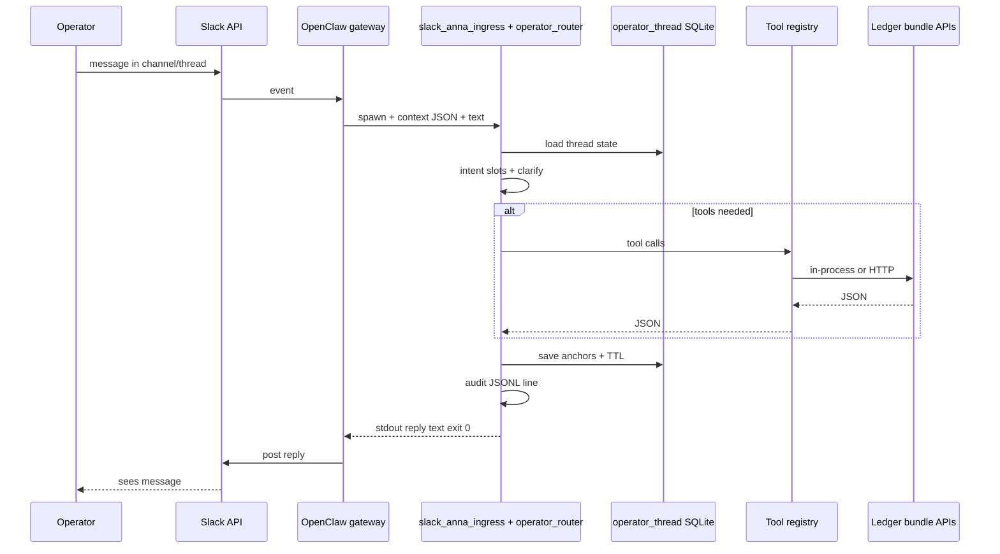

# Slack Conversational Operator System — Low-Level Design (LDD)

**Status:** Contractual (implementation target)  
**Lock-down (BBX-SLACK-002):** §0 (boundary + **posture**), §4.4, §12 (first PR items 1–6), §§19–22, **§24** (runtime fit, inventory, cutover), **§25** (readiness gate — **no implementation start** until governance package complete) — normative for implementation and proof.  
**Audience:** Engineering (implementer), Operator (acceptance), Architect (governance)  
**Scope:** Slack-native conversational interface over BlackBox / OpenClaw with **grounded** answers, **optional named-agent presentation**, **document-grounded** project Q&A, and **auditable** routing.

**Governance cross-references (must stay aligned):** [`PROJECT_SYSTEM_SPECIFICATION.md`](../PROJECT_SYSTEM_SPECIFICATION.md) (multi-surface platform, messaging ingress), [`development_governance.md`](../development_governance.md) (BBX-SLACK program pointer), [`canonical_development_plan.md`](canonical_development_plan.md) (phases BBX-SLACK-001+).

**Document location:** `docs/architect/slack_conversational_operator/` (this folder is the working home for this system’s architecture).

**Out of scope for this LDD:** Live venue order submission; full training-system integration; replacing HTTP APIs with LLM inference for factual trading data.

---

## 0. System boundary, platform fit, and truth discipline

This section **locks the OpenClaw / BLACK BOX boundary** so engineering does not build against an ambiguous model. It is **normative** for BBX-SLACK-002 and matches the canonical plan’s **single default ingress** and **grounded tool** requirements.

### 0.1 BLACK BOX vs OpenClaw — responsibility split

| Layer | What it is | Owns (this initiative) |
|-------|------------|---------------------------|
| **BLACK BOX** | Repository **system of record** — domain modules, tools, runtime, dashboards, governance, **source-of-truth** behavior (`~/blackbox`). | **Operator router** package; **intent/slots**; **grounded tool registry**; **audit** JSON contract per turn; **SQLite** operator thread state; **access-control** checks in Python; **final reply text** for bridge **exit 0** (including presentation/containment rules **on that text** before stdout). **All factual** answers about trading/system state must be **assembled here** from tools or `clarify` / doc path — never invented in the gateway. |
| **OpenClaw** | **Interaction / backend** layer on the lab host — Slack-facing **ingress**, gateway process, **dispatch**, bridge **invocation**, streaming UX, credentials, lifecycle (**outside** this repo). | Slack **connection**; **dispatch.ts** → spawn BlackBox bridge; pass **context payload**; **stderr** correlation with **trace**; **embedded** assistant path when bridge **exit 2** (general chat / out-of-scope). OpenClaw **does not** author ledger rows, policy outcomes, wallet balances, ingest metrics, or bundle truth. |

**No blurring:** OpenClaw is not a second place to “decide” operator facts. BLACK BOX is not a second Slack server — Slack I/O stays in the gateway.

### 0.2 Platform fit (multi-surface BLACK BOX)

BBX-SLACK is a **new conversational operator slice** (Slack → OpenClaw → BLACK BOX router) **inside** an already **multi-surface** platform (`PROJECT_SYSTEM_SPECIFICATION.md` — Telegram/Slack, UIUX.Web, runtime CLIs, sandbox dashboards).

**This slice does not replace:** Telegram messaging, **Bolt** Socket Mode, **UIUX.Web** dashboard/API, **scripts/runtime** CLIs, legacy operator dashboards, or other surfaces. It **adds** a governed Slack operator path; **convergence** means alternate ingresses (e.g. Bolt) should call the **same** router module when wired — **not** that other surfaces are removed.

### 0.3 Truth-system discipline (non-negotiable)

- **Factual** answers about **trading activity, system status, policy explanation, wallet state, ingest state, dashboard/bundle state** MUST come only from **BLACK BOX** **grounded router + tool layer** (or `clarify` / allowlisted **doc** tools when class B is in scope — **§12 item 7**).
- **Persona** (named or default) is **presentation only** and MUST NOT add or alter facts (**§2 P5**).
- **OpenClaw embedded model** output (after **exit 2**) is **not** operator-grounded truth for **§4.4** in-scope domains; it is **general** chat. Operators must not be led to treat it as ledger/API truth.
- **Gateway** configuration and **persona wiring** in OpenClaw do **not** override the **tool-only** rule for in-scope operator questions.

### 0.4 Persona enforcement — one owner per path (no duplicate transforms)

**Two paths, one rule: each body of text is enforced exactly once.**

| Path | Who applies final text rules before Slack sees it |
|------|---------------------------------------------------|
| **Bridge success (exit 0)** — operator router reply | **BLACK BOX** only: `messaging_interface/slack_persona_enforcement.py` (or successor) on **stdout** content. **OpenClaw must not** run `run_slack_persona_enforce` (or any second strip) on that text. |
| **Embedded / fallback (exit 2)** — gateway model | **OpenClaw** only: gateway-owned persona/containment for **that** response stream. **BLACK BOX does not** post-process exit 2. |

**Metadata:** OpenClaw may set **`SLACK_PERSONA_ROUTE`** (or equivalent) for routing/display **without** rewriting BLACK BOX stdout.

**Invalid:** Applying **both** BlackBox and OpenClaw **text** enforcement to the **same** bridge output.

### 0.5 Implementation posture — interception, not greenfield (architect)

BBX-SLACK is **not** a blank-slate messaging build. **OpenClaw** already provides Slack-facing backend, dispatch, and **embedded** conversational behavior; **BLACK BOX** already has domain/runtime/tooling and an **Anna** bridge (`scripts/openclaw/slack_anna_ingress.py`, `anna_entry.py` path). **Default/system** paths can answer **broad generic** prompts via the gateway when the bridge does not handle the turn.

**Normative posture:**

1. **Inventory before behavior change** — Document the **live** route map (§24.2); verify on **clawbot** where host-specific.
2. **Insert, do not replace wholesale** — The **operator router** is a **layer** in the existing bridge/ingress order (see §24.3). Do **not** duplicate parallel Slack stacks unless this LDD explicitly authorizes them.
3. **Preserve or narrow intentionally** — If existing default/system behavior is **unchanged**, state so and **prove** (regression checklist). If it is **narrowed** (e.g. fewer messages reach embedded-only), state the **new boundary** and **prove** it matches §4.4.
4. **Cutover in docs first** — Current state, target state, interception point, fallback, rollback: **§24**.

**Truth boundary remains hard (§0.3):** generic or embedded behavior must **not** become source of truth for trading/system facts; those flow through BLACK BOX tools.

---

## 1. Purpose

Deliver a **single conversational system** where a human can:

1. **Ask operational / trading questions** in natural language and receive answers **grounded in tools** (ledger, policy, market ingest, dashboard bundle, wallet APIs).
2. **Optionally address a named persona** (e.g. Anna, DATA) for **tone and formatting only**, not for a different source of truth.
3. **Ask questions about the project** that are answered from **allowed documentation** (Markdown and similar under the repo), with **citations**, without requiring the operator to read code.

Move from **ambiguous intent** to a **contract**: intent labels, slots, tool calls, logging, and clarification rules are **specified** below.

---

## 2. Design Principles (Non-Negotiable)

| ID | Principle |
|----|------------|
| P1 | **Natural language first** — no required command vocabulary for the operator. |
| P2 | **Clarification over guessing** — at most 1–2 targeted follow-ups when intent or slots are ambiguous. |
| P3 | **Grounded answers only** — trading, PnL, policy outcomes, sync state, wallet balances come **only** from defined tools/APIs. |
| P4 | **Single tool layer** — default path and named path **must** call the **same** tool functions for the same intent/slots. |
| P5 | **Persona is presentation** — named agent = style/tag only; **never** a separate data-access path for factual domains. |
| P6 | **Context assists, never replaces truth** — thread memory resolves references and carries slots; it does **not** author PnL or policy results. |
| P7 | **Everything auditable** — each turn logs intent, slots, tools invoked, source refs, trace_id. |

---

## 3. High-Level Architecture

**Boundary:** See **§0** — OpenClaw transports; BLACK BOX interprets and grounds.

```
Slack (only operator interface for this system)
    → OpenClaw gateway / dispatch
        → BlackBox Interpreter + Router (this LDD)
            → Intent + slot extraction (+ clarification)
            → Tool layer (Python/HTTP; single registry)
            → Source systems (SQLite ledger, market DB, policy evaluators, bundle builders, wallet module)
        → Context subsystem (thread state + reference resolution + optional doc retrieval index)
            → NOT authoritative for numeric/ledger/policy facts
```

**Supporting components:**

- **`modules/context_engine/`** — operational events, health/status ticks (see existing API patterns).
- **Thread store** (new or extended) — Slack `team/channel/thread_ts` keyed; stores last resolved entities (e.g. `last_trade_id`, `last_market_event_id`, clarified filters).

---

## 4. Dual Routing Model (Contractual)

### 4.1 Default mode (primary UX)

- User does **not** name an agent.
- Router sets `presentation_route = default`.
- Intent/slots/tools execute as in Section 6–7.

### 4.2 Named mode (optional overlay)

- User message matches **named-invoke** pattern (configurable list: e.g. leading `Anna,`, `Anna:`, `DATA,`, case rules TBD).
- Router sets `presentation_route = anna | data | …` **only** after stripping the invoke prefix for intent detection.
- **Same** `intent`, **same** `slots`, **same** `tool_calls` as default for factual domains.
- Output formatter may apply persona template (opening line, emoji policy, length) — **must not** add facts not present in tool outputs.

### 4.3 Critical rule

There shall be **no** code path where:

- `presentation_route=anna` calls different SQL/APIs than `presentation_route=default` for the **same** `(intent, slots)`.

Exception (explicitly allowed, separate intents): **non-factual** “analyst narrative” or **long-form** analysis may be a distinct intent (`deep_analysis`) that **still** must ground **factual claims** via tools or cite **docs**; **must not** invent ledger rows.

### 4.4 Router decline boundary (exit 2) — contractual

**Goal:** Avoid a **second truth system** (embedded model) answering BlackBox factual or doc-grounded domains. `exit 2` fallthrough to the OpenClaw embedded model is **narrow**.

**Inside the operator router (must not decline; must handle or `clarify`):**

| Domain | Examples | Route |
|--------|----------|--------|
| **System / trading state (class A)** | **System status**, **trading activity**, **policy explanation**, **wallet state**, **ingest state**, **dashboard/bundle state**, tile/trade explanations | Tools + reply, or `clarify` for missing slots |
| **Project documentation (class B)** | **Project docs** — questions answerable from allowlisted docs with citations | `doc_project_qa` + tools, or `clarify` (when §12 item 7 shipped) |
| **Ambiguous operator intent (class C)** | Missing scope, missing anchor | `clarify` (max 2 questions), not exit 2 |

**Exit 2 (`router_declined`) is allowed only** when the message is **clearly general chat** with no reasonable mapping to classes A–C, e.g.:

- Greetings / small talk with **no** operational hook (optional: deterministic short reply with exit 0 instead — implementation choice; if so, exit 2 never used for greetings).
- Creative writing, unrelated trivia, or other topics **not** covered by tools or allowlisted docs, **and** the router’s classifier confidence is below threshold with **no** safe tool path.

**Exit 2 is forbidden** when any of the following apply:

- User asks about **ledger, trades, wallet, ingest, policy, dashboard/bundle, or project docs** — even if phrasing is vague (use `clarify` or default tools per config).
- User mixes in-scope and out-of-scope content — **process the in-scope part** (split reply or clarify); do not exit 2 for the whole turn.

**Audit:** Every turn including **exit 2** writes the §10 audit line. For exit 2, include `router_declined: true`, `decline_reason` (enum), and `trace_id` (§19.4).

---

## 5. Answer Classes (Separation of Concerns)

Implementer must implement **three** answer classes with distinct grounding rules:

| Class | Grounding | Example questions |
|-------|-----------|-------------------|
| **A — Operational / trading facts** | Tools only (ledger, bundle, policy rows, ingest, wallet) | “Last 15 closed trades”, “why no trade on this tile”, “is V3 synced to Binance”, “wallet balance” |
| **B — Project documentation** | Allowed doc corpus only (read + summarize + **mandatory citations**: file path + heading or excerpt id) | “What is the baseline policy?”, “How does JUPv3 differ from V2?”, “What is Foreman?” |
| **C — Clarification** | No external grounding; returns questions | “Baseline only or all strategies?” |

**Class B** must **not** use the LLM to invent trading numbers. If the user mixes (“what’s my PnL and what does the doc say about baseline?”), split into **tool parts** + **doc parts** with clear boundaries in the reply.

---

## 6. Internal Intent Set (Not User-Facing)

Intents are **for routing, tests, and logs** only. Operators do not memorize these names.

| Intent ID | Description | Typical slots |
|-----------|-------------|----------------|
| `explain_trade` | Why a trade / position / tile outcome | `trade_id` or `market_event_id`, optional `strategy_scope` |
| `list_trades` | List recent closed trades | `limit`, `scope` (baseline \| all), `order` (exit_time \| created) |
| `export_trades` | Export CSV or table attachment | same as `list_trades` + `format` |
| `policy_explain` | Policy / signal reason for a bar or slot | `policy_slot` (JUPv2 \| JUPv3), optional `market_event_id` |
| `ingest_status` | Pyth vs Binance / freshness | `lane` (v2 \| v3 \| both) |
| `wallet_status` | Balances / connection | none or `asset` |
| `bundle_snapshot` | Operator dashboard bundle slice | optional keys list |
| `doc_project_qa` | Answer from documentation corpus | `query`, optional `doc_glob` |
| `clarify` | Ask user for missing slots | `missing_slots[]`, `question_text` |

**Versioning:** bump `intent_schema_version` in logs when adding/removing intents.

---

## 7. Tool Layer (Single Registry)

### 7.1 Contract

- Every tool is a **pure function** with a **typed input** and **JSON-serializable output** (or error object).
- Tools **may** call:
  - HTTP: `GET/POST` to existing BlackBox APIs (e.g. `/api/v1/dashboard/bundle`, `/api/v1/wallet/status`, baseline trades report route) with `localhost` or configured base URL.
  - In-process Python: `build_dashboard_bundle`, `fetch_trade_export_rows`, `build_baseline_trades_report`, `build_context_engine_status`, etc.
- Tools **must not** call LLMs for class A facts.

### 7.2 Initial tool map (minimum Phase 1)

| Tool ID | Purpose | Primary source |
|---------|---------|----------------|
| `tool.trades.list` | Last N closed trades | `execution_trades` / `fetch_trade_export_rows` or baseline report builder |
| `tool.trades.export` | CSV bytes + filename | Same + CSV formatter |
| `tool.bundle.get` | Dashboard bundle slice | `build_dashboard_bundle` or HTTP |
| `tool.wallet.get` | Wallet status | `build_wallet_status_payload` or HTTP |
| `tool.ingest.freshness` | V2 vs V3 freshness | Bundle `five_m_ingest_freshness` + `event_axis_source` |
| `tool.policy.row` | Policy evaluation for MID | `policy_evaluations` / existing fetch helpers |
| `tool.context_engine.status` | Context engine health | `build_context_engine_status` |

### 7.3 Documentation tools (class B)

| Tool ID | Purpose | Rules |
|---------|---------|--------|
| `tool.docs.search` | Find relevant chunks | **Allowlist** roots only (e.g. `docs/`, `UIUX.Web/content/`, `agents/` — **exact list in config**). No arbitrary `../`. |
| `tool.docs.read` | Read one file under allowlist | Max size cap; binary rejected |

**Doc answering flow:** `doc_project_qa` → retrieve via `tool.docs.search` + `tool.docs.read` → LLM **summarizes only from provided excerpts** → output includes **“Sources:”** with paths.

---

## 8. Context Subsystem (Thread + Reference Resolution)

### 8.1 Stored per Slack thread (minimum keys)

- `thread_id` (Slack channel + thread_ts composite)
- `last_intent` (optional)
- `last_slots` (partial)
- `anchors`: `{ last_trade_id?, last_market_event_id?, last_export_scope?, last_doc_query? }`
- `clarification_pending`: boolean + which slots

### 8.2 Reference resolution (examples)

| User phrase | Resolution rule |
|-------------|-------------------|
| “that trade” | Use `anchors.last_trade_id` or `last_market_event_id`; if missing → **clarify** |
| “the last one” | Use most recent from **prior tool result** in thread cache |
| “baseline only” | Set `scope=baseline` in slots |

### 8.3 Explicit non-responsibilities

- Context does **not** store authoritative PnL or trade results except as **cached copies** of tool outputs for reference resolution.
- On restart, **re-fetch** facts if stale beyond TTL (configurable).

---

## 9. Clarification Protocol

**Ask** (max 2 questions) when:

- `list_trades` / `export_trades` and `scope` is ambiguous (baseline vs all).
- Reference (“that trade”) has no anchor.
- `doc_project_qa` and query is empty after strip.

**Do not ask** when:

- Safe defaults are documented (e.g. default `limit=15`, `scope=baseline` for operator reports) — **must be listed in config** so behavior is contractual.

**Output:** intent `clarify` with `question_text` + log `clarification_reason`.

---

## 10. Logging and Audit (Per Turn)

Required fields (JSON line or structured log):

- `trace_id` (UUID)
- `slack_team`, `channel`, `thread_ts` (or equivalent)
- `presentation_route` (default | anna | data | …)
- `intent` (or `clarify`)
- `slots` (object)
- `tool_calls[]` — `{ tool_id, input_hash or redacted_input, ok, duration_ms }`
- `source_refs[]` — e.g. `{ type: "api", path: "/api/v1/dashboard/bundle" }`, `{ type: "ledger", query: "execution_trades limit 15" }`, `{ type: "doc", path: "docs/architect/foo.md" }`
- `intent_schema_version`

**Retention:** per operator governance (not fixed in this LDD).

---

## 11. Slack Integration Points (Existing vs New)

**Existing (repo today):**

- `scripts/openclaw/slack_anna_ingress.py` — explicit Anna / greeting; exit 2 defers to embedded model.
- `messaging_interface/slack_adapter.py` — Bolt path with dispatch pipeline.
- `apply_openclaw_dispatch_anna_ingress.py` — patch for dispatch.

**New work (Phase 1):**

- **Router service** (or OpenClaw skill bundle) implementing Sections 6–10.
- **Thread context store** (SQLite or Redis — choose one; document in implementation PR).
- **Tool registry** package with tests.
- **Doc allowlist config** + search (start with **ripgrep** or **simple substring index**; upgrade to embeddings later without breaking contract).

---

## 12. Phased Implementation Checklist (Implementer)

**First-merge scope (BBX-SLACK-002, locked):** Phase 1 items **1–6 only** in the **first implementation PR**. Item **7** (`doc_project_qa`) is **out of scope** for that PR unless the Architect explicitly reopens scope. PR body must state: `BBX-SLACK-002: §12 items 1–6`.

### Phase 1 (MVP)

1. [ ] Tool registry + `tool.trades.list`, `tool.bundle.get`, `tool.wallet.get`, `tool.ingest.freshness` wired to real code paths.
2. [ ] Intent + slot extractor (LLM with JSON schema **or** small rules + LLM fallback) with **tests** on golden utterances.
3. [ ] Thread context store + reference resolution for “that trade” / “last one” using anchors.
4. [ ] Clarification flow for `scope` baseline vs all.
5. [ ] Named-invoke strip + `presentation_route` (style only).
6. [ ] Audit log line per Section 10.
7. [ ] `doc_project_qa` with allowlist + `tool.docs.read` + cited summaries (no numeric trading facts from docs).

### Phase 2 (optional)

- [ ] CSV attachment upload to Slack for `export_trades`.
- [ ] Richer doc search (chunking + embeddings) **same** allowlist contract.
- [ ] Additional intents (training summaries) with **same** tool-only rule for facts.

---

## 13. Acceptance Criteria (Operator / Architect)

1. Same factual question (same utterance) with **default** vs **named** route yields **identical** tool_calls and **same** numeric facts (allowing only formatting differences).
2. No answer claims wallet balance or PnL without `tool.wallet.get` or equivalent in logs.
3. Doc answers include **Sources:** with repo-relative paths under allowlist.
4. Ambiguous trade list requests produce **at most two** clarifying questions or apply safe defaults **defined in config** (defaults must be documented for operator).

---

## 14. One-Line Summary

**Slack is the surface; BlackBox/OpenClaw runs the interpreter; one tool layer grounds all factual trading and system state; context and docs assist interpretation; named agents are presentation-only overlays; documentation Q&A is allowlisted and cited — never a substitute for ledger or APIs.**

---

## 15. Document Control

- **Owner:** Engineering (with Architect approval on intent schema changes).
- **Updates:** When adding intents/tools, bump `intent_schema_version` and append a short changelog at the end of this file.

---

## 16. Implementation gaps (fill before / during coding)

This section turns the LDD into an implementable checklist: **decisions**, **missing contracts**, and **where code lives today**. The next implementer should close or explicitly defer each item.

**Resolved defaults:** Recommended answers for these gaps are in **§17 Gap resolutions** — use them unless the Architect overrides.

### 16.1 Deployment and runtime boundary

| Gap | What to decide / produce |
|-----|----------------------------|
| **Bolt vs OpenClaw vs both** | Today: **Bolt** uses `messaging_interface/slack_adapter.py` → `run_dispatch_pipeline` (no OpenClaw). **OpenClaw** uses patched `dispatch.ts` + `scripts/openclaw/slack_anna_ingress.py` (Anna short-circuit only). Decide whether the conversational operator runs **only** behind OpenClaw, or whether both paths must call the **same** interpreter (shared Python package + two entrypoints). |
| **Thread-aware ingress** | LDD §8 assumes `team_id`, `channel`, `thread_ts`. `slack_anna_ingress.py` currently receives **text only**. Specify argv/env/JSON body for one turn, including thread metadata. |
| **Streaming vs single reply** | OpenClaw may stream; LDD assumes auditable **turns**. Define whether tools block until complete before any assistant text, and how `trace_id` spans partial streams. |

**Primary paths:** `messaging_interface/slack_adapter.py`, `messaging_interface/pipeline.py`, `scripts/openclaw/slack_anna_ingress.py`, `scripts/openclaw/apply_openclaw_dispatch_anna_ingress.py`, OpenClaw `extensions/slack/.../dispatch.ts` on **clawbot** (not in this repo).

### 16.2 OpenClaw ↔ BlackBox contract

| Gap | What to decide / produce |
|-----|----------------------------|
| **Replace/wrap ingress** | New router vs extending `slack_anna_ingress.py`; exit codes, max output size, timeouts. **Decline:** §4.4. |
| **trace_id ownership** | **Resolved:** Python generates; handoff **§19.4** (stderr line). |
| **Build/restart proof** | Document clawbot steps: `git pull`, `pnpm build` in `~/openclaw` when `dispatch.ts` changes, gateway restart — aligned with existing patch script comments. |

### 16.3 Router vs existing Telegram dispatch

| Gap | What to decide / produce |
|-----|----------------------------|
| **Coexistence** | `run_dispatch_pipeline` → `telegram_interface/message_router` + `agent_dispatcher` is **hashtag/persona** routing, not §6 intents. Map: migrate Slack/OpenClaw only vs all transports; feature parity table (e.g. `#status`, `@data` vs `bundle_snapshot`, `ingest_status`). |

**Primary paths:** `messaging_interface/pipeline.py`, `scripts/runtime/telegram_interface/`.

### 16.4 Intent + slot extraction

| Gap | What to decide / produce |
|-----|----------------------------|
| **Parser stack** | LLM + JSON schema vs rules-first + LLM fallback; behavior on invalid JSON. |
| **Model/runtime** | Same as Anna (`OLLAMA_*`) vs dedicated routing model. |
| **Golden tests** | Fixture location (e.g. `tests/fixtures/operator_intents/`), CI policy (network/mock). |
| **intent_schema_version** | Single module constant; bump on schema change (§15 changelog). |

### 16.5 Tool bindings (sign off each tool)

Each LDD tool needs **exact** Python/HTTP binding, **inputs**, and **error shapes**.

| Tool ID | Repository anchors (verify when wiring) |
|---------|----------------------------------------|
| `tool.trades.*` | `modules/anna_training/trade_export_csv.py` (`fetch_trade_export_rows`); baseline reporting via `build_baseline_trades_report` (see `modules/anna_training/dashboard_bundle.py` / tests). Decide list vs report per utterance. |
| `tool.bundle.get` | `build_dashboard_bundle` in `modules/anna_training/dashboard_bundle.py` (parameters, e.g. `max_events`). |
| `tool.wallet.get` | `modules/wallet/solana_wallet.py` → `build_wallet_status_payload`. |
| `tool.ingest.freshness` | Bundle keys such as `five_m_ingest_freshness`, `event_axis_source`; define “stale.” |
| `tool.policy.row` | Helpers around `policy_evaluations` (e.g. `fetch_policy_evaluation_for_market_event`, baseline variants — see `dashboard_bundle`). |
| `tool.context_engine.status` | `modules/context_engine/status.py` → `build_context_engine_status`. |
| **HTTP alternative** | `UIUX.Web/api_server.py` — base URL, auth, when to use HTTP vs in-process (containers/tests). |

### 16.6 Thread context store (net new)

| Gap | What to decide / produce |
|-----|----------------------------|
| **SQLite vs Redis** | Schema/migrations; connection string or file path. |
| **Thread key** | Normalize `team_id + channel_id + thread_ts`; top-level vs reply behavior. |
| **TTL / eviction** | §8.3; locking/concurrency. |
| **Avoid duplicate memory** | Relate to `scripts/runtime/anna_modules/context_memory.py` and `modules/context_engine/store.py` — reuse vs separate **operator thread** store (single source of truth). |

### 16.7 Named presentation routes

| Gap | What to decide / produce |
|-----|----------------------------|
| **Invoke patterns** | §4.2 “case rules TBD”; extend beyond `messaging_interface/anna_slack_route.py` (Anna-only today). |
| **Outbound formatting** | `messaging_interface/slack_persona_enforcement.py` is `system \| anna`; extend for `data` and LDD routes without branching tools. |
| **OpenClaw env** | e.g. `SLACK_PERSONA_ROUTE` pattern in patched `dispatch.ts`. |

### 16.8 Documentation tools (class B)

| Gap | What to decide / produce |
|-----|----------------------------|
| **Allowlist config** | Exact repo roots; no `..` / symlink escape. |
| **Search** | ripgrep (timeout, encoding) vs index; test determinism. |
| **`tool.docs.read`** | Max bytes; citation format (“Sources:” + path + heading). |
| **LLM** | Strict “summarize only provided excerpts” prompt. |

### 16.9 Audit logging

| Gap | What to decide / produce |
|-----|----------------------------|
| **Log sink** | File vs unified operator log (e.g. `FOREMAN_V2_UNIFIED_LOG_PATH` where applicable). |
| **Redaction** | `input_hash` vs redacted args; Slack user ids. |

### 16.10 Clarification defaults

| Gap | What to decide / produce |
|-----|----------------------------|
| **Config file** | §9 safe defaults (`limit`, `scope`, etc.) in one contractual artifact (path + schema). |

### 16.11 Slack product behavior

| Gap | What to decide / produce |
|-----|----------------------------|
| **Thread replies** | Bolt `say` must use `thread_ts` where appropriate so §8 keys match reality (`slack_adapter.py`). |
| **Blocks vs plain text** | Architect blocks: `slack_architect_diagnostics.py` — keep/drop for new flow. |
| **Phase 2** | CSV upload API (`files.upload`) per §12. |

### 16.12 Security and operations

| Gap | What to decide / produce |
|-----|----------------------------|
| **Allowlist** | Workspaces/channels allowed to invoke tools. |
| **Rate limits** | Doc search + DB-heavy tools. |
| **Secrets** | No tokens in logs. |

### 16.13 Automated acceptance tests

| Gap | What to decide / produce |
|-----|----------------------------|
| **Default vs named** | Same `tool_calls` / same numeric facts (structured compare). |
| **Grounding** | Assertions that PnL/wallet claims imply tool log lines. |

### 16.14 Program / governance alignment

| Gap | What to decide / produce |
|-----|----------------------------|
| **Phase scope** | Repo phase rules vs this LDD; first PR may ship §12 MVP subset — state explicitly in PR if needed. |

### 16.15 Repository map (quick reference)

| Area | Paths |
|------|--------|
| Slack transport | `messaging_interface/slack_adapter.py`, `slack_persona_enforcement.py`, `anna_slack_route.py`, `slack_architect_diagnostics.py` |
| OpenClaw bridge | `scripts/openclaw/slack_anna_ingress.py`, `apply_openclaw_dispatch_anna_ingress.py`, `apply_openclaw_slack_patch.py` |
| Shared dispatch | `messaging_interface/pipeline.py`, `scripts/runtime/telegram_interface/` |
| Bundle / trades / policy | `modules/anna_training/dashboard_bundle.py`, `modules/anna_training/trade_export_csv.py` |
| Wallet / context engine | `modules/wallet/`, `modules/context_engine/status.py` |
| HTTP API | `UIUX.Web/api_server.py` |

---

## 17. Gap resolutions (recommended v1 defaults)

**Purpose:** Answer the open items in §16 so implementation can proceed without re-litigating basics. Architect may override; update this section and the changelog when decisions change.

### 17.1 Deployment and runtime (§16.1)

| Gap | Recommended resolution |
|-----|-------------------------|
| Bolt vs OpenClaw | **Primary path:** OpenClaw Slack dispatch on clawbot (patched `dispatch.ts`). **Single interpreter:** new Python package/module (e.g. `messaging_interface/operator_router/`) invoked from ingress; **Bolt** (`slack_adapter.py`) may call the same module later for parity — not two different tool paths. |
| Thread-aware ingress | Extend ingress to accept **JSON on stdin** or env **`SLACK_OPERATOR_CONTEXT_JSON`**: `{ "text", "team_id", "channel_id", "thread_ts", "user_id" }`. Plain argv text remains supported for tests; production passes full context. |
| Streaming vs single reply | **Contract:** No user-visible assistant tokens until **tools complete** (or clarification question emitted). `trace_id` created at **start of turn**; streaming (if any) only for **final NL wrap**, not interleaved with tool calls. |

### 17.2 OpenClaw ↔ BlackBox (§16.2)

| Gap | Recommended resolution |
|-----|-------------------------|
| Replace/wrap ingress | **Wrap:** New `slack_operator_router.py` (or extend `slack_anna_ingress.py`) — order: greeting → named strip → **operator router** (intent/tools) → exit 2 **only** per §4.4. Exit codes: `0` = router handled, `2` = fall through. **Timeouts:** router 90s hard cap; tool sub-calls individually timed. |
| trace_id handoff | **Exact format (§19.4):** first line of **stderr** must be `BLACKBOX_TRACE_JSON:` + single JSON object (no pretty-print, one line). **Stdout** is **only** the operator-facing reply text (or empty on exit 2). Gateway parses stderr line for correlation only. |
| Build/restart proof | Follow existing **`apply_openclaw_*`** docs: clawbot `git pull` blackbox + openclaw, `pnpm build` when `dispatch.ts` changes, `systemctl --user restart openclaw-gateway` (or project standard). |

### 17.3 Telegram vs Slack (§16.3)

| Gap | Recommended resolution |
|-----|-------------------------|
| Coexistence | **Phase 1:** Implement **Slack/OpenClaw only** for the operator router. Telegram keeps **`message_router`** behavior; add a **feature parity matrix** in PR when Slack MVP ships (do not block Slack on Telegram). |

### 17.4 Intent + slot extraction (§16.4)

| Gap | Recommended resolution |
|-----|-------------------------|
| Parser stack | **Rules-first** for high-precision patterns (e.g. “last N trades”, “wallet”, “bundle”); **LLM JSON schema** for the rest; on invalid JSON → single clarify “I didn’t catch the filters — …”. |
| Model/runtime | **Same Ollama base URL as Anna** unless `OPERATOR_ROUTER_MODEL` set; keeps ops simple. |
| Golden tests | **`tests/fixtures/operator_intents/*.json`** — CI runs **offline** (mock tools). |
| intent_schema_version | **`messaging_interface/operator_router/schema.py`** (or equivalent under the same package as §17.1) — constant `INTENT_SCHEMA_VERSION = "1"`. |

### 17.5 Tool bindings (§16.5)

| Gap | Recommended resolution |
|-----|-------------------------|
| HTTP vs in-process | **In-process** on clawbot where Python shares repo + env (`BLACKBOX_*`). **HTTP** optional for tests against `api_server` or remote host — same tool implementation, two transports behind one interface. |
| list vs report | **`list_trades`** → `fetch_trade_export_rows` (fast strip); **`export_trades` / formal baseline** → `build_baseline_trades_report` when scope needs policy classification — intent maps utterance to one or the other. |

### 17.6 Thread context store (§16.6)

| Gap | Recommended resolution |
|-----|-------------------------|
| SQLite vs Redis | **SQLite** file: `data/sqlite/operator_slack_threads.sqlite` (or under `BLACKBOX_CONTEXT_ROOT`) — single-writer, simple backup. |
| Thread key | **Normative:** §21 (`thread_key` formula and `thread_ts_effective`). |
| TTL | **7 days** last-access eviction; configurable. |
| Duplicate memory | **New table** `operator_thread_state` — do **not** overload `anna_modules/context_memory.py` for Slack operator keys; may **read** context_engine events for health but not mix PnL into thread table. |

### 17.7 Named presentation (§16.7)

| Gap | Recommended resolution |
|-----|-------------------------|
| Invoke patterns | **`Anna,` / `Anna:` / `DATA,` / `DATA:`** line-leading; case-insensitive; strip before intent. Add **`@anna` / `@data`** substring match consistent with existing Slack patterns. |
| **Persona enforcement (one owner per path)** | **Normative:** **§0.4**. **Exit 0:** BLACK BOX only **text** enforcement before stdout; OpenClaw **must not** re-enforce bridge text. **Exit 2:** OpenClaw owns embedded path persona/containment. **Duplicate** enforcement on the same bridge body is **invalid**. |
| OpenClaw env | Set **`SLACK_PERSONA_ROUTE`** from router result for send path (metadata; **no** rewrite of BLACK BOX stdout). |

### 17.8 Documentation tools (§16.8)

| Gap | Recommended resolution |
|-----|-------------------------|
| Allowlist | Config file **`config/operator_doc_allowlist.txt`** — one glob or prefix per line: `docs/`, `agents/`, `UIUX.Web/content/`, `README.md` at repo root optional. |
| Search | **`rg` subprocess** with timeout **3s**, max matches **40**; deterministic sort by path. |
| tool.docs.read | **Max 512 KiB**; UTF-8; reject binary. |
| LLM | System prompt: **“Answer only from EXCERPTS; if insufficient say so; cite Sources: path.”** |

### 17.9 Audit logging (§16.9)

| Gap | Recommended resolution |
|-----|-------------------------|
| Log sink | **`logs/operator_router.jsonl`** (repo-relative on clawbot) **or** append to **`FOREMAN_V2_UNIFIED_LOG_PATH`** when set — one line JSON per turn. |
| Redaction | Log **Slack user id** hashed; tool args: **truncate** strings > 500 chars; never log **tokens**. |

### 17.10 Clarification defaults (§16.10)

| Gap | Recommended resolution |
|-----|-------------------------|
| Config file | **`config/operator_clarify_defaults.yaml`** — e.g. `list_trades: { limit: 15, scope: baseline, order: exit_time_desc }`. Operator doc one paragraph pointing to file. |

### 17.11 Slack product behavior (§16.11)

| Gap | Recommended resolution |
|-----|-------------------------|
| Thread replies | **Always** reply in **same thread** as user when `thread_ts` present; top-level only when user message was top-level. |
| Architect blocks | **Keep** for diagnostics in dev/staging; **optional** in prod operator channel (env flag). |

### 17.12 Security (§16.12)

| Gap | Recommended resolution |
|-----|-------------------------|
| Allowlist | Env **`SLACK_OPERATOR_ALLOWED_WORKSPACE_IDS`**; **`SLACK_OPERATOR_ALLOWED_CHANNEL_IDS`** (**§22** — channel required for prod expectation). Optional **`SLACK_OPERATOR_ALLOWED_USER_IDS`**. **`SLACK_OPERATOR_DEV_MODE=1`** skips allowlists (non-prod only). |
| Rate limits | **30** tool-heavy turns / user / hour (configurable). |
| Secrets | Never log `SLACK_BOT_TOKEN`, OpenClaw tokens, or wallet keys. |

### 17.13 Acceptance tests (§16.13)

| Gap | Recommended resolution |
|-----|-------------------------|
| Default vs named | **pytest** with mocked tools: assert `tool_calls` list identical for `why no trade` vs `Anna, why no trade`. |
| Grounding | Assert any message containing `$` or `balance` implies `tool.wallet.get` in captured log. |

### 17.14 Governance (§16.14)

| Gap | Recommended resolution |
|-----|-------------------------|
| Phase scope | **Locked:** §12 first-merge **1–6 only**; item **7** in a **subsequent** PR unless Architect reopens. PR body must cite `BBX-SLACK-002` and item range. |

---

## 18. End-to-end process map (complete before implementation)

**Purpose:** One place that maps **every hop** from operator message to reply, including **hosts**, **repos**, **exit codes**, and **deployment order**. Implementation must not start until this section is accepted (or explicitly amended).

**Primary product path (per §17):** Slack → **OpenClaw gateway** on **clawbot** → **BlackBox Python** (`slack_anna_ingress` / operator router) → tools → reply → OpenClaw → Slack.

**Secondary path (parity, not MVP):** Slack → **Bolt Socket Mode** (`slack_adapter.py`) → same operator router module (future wiring).

---

### 18.1 Actors and data stores

| Actor | Role |
|-------|------|
| **Slack API** | Delivers messages; receives replies (threaded or channel). |
| **OpenClaw gateway** | Node process on clawbot; Slack adapter; streaming/draft; invokes BlackBox bridge script. |
| **BlackBox repo** (`~/blackbox`) | Operator router, tools, SQLite thread state, audit logs, config files. |
| **Ollama (optional)** | Intent/slot JSON and doc-summary LLM when enabled; CI uses mocks. |
| **SQLite** | `operator_slack_threads` (§17.6); existing ledger DBs unchanged by this LDD. |

---

### 18.2 Ingress paths (two doors, one interpreter)

| Path | Entry | When used |
|------|--------|-----------|
| **A — OpenClaw (primary)** | Patched `dispatch.ts` in **`~/openclaw`** calls `python3 …/slack_anna_ingress.py` (and eventually passes **context JSON** — see §18.3). | Production operator Slack wired through OpenClaw. |
| **B — Bolt (secondary)** | `messaging_interface/slack_adapter.py` | Direct Socket Mode from BlackBox; **not** required for MVP if all Slack goes through OpenClaw. |

**Contract:** Both paths must eventually call the **same** `messaging_interface/operator_router/` implementation (§17.1). MVP may ship **path A only**.

---

### 18.3 OpenClaw → BlackBox bridge (current vs target)

**Current (repo today):**

1. `dispatch.ts` runs `slack_anna_ingress.py` with **one string argv** (message text after mention strip).
2. Exit `0` + stdout → deliver reply as Anna; exit `2` → fall through to **embedded model** in gateway.
3. Greeting short-circuit and explicit-Anna routing in `slack_anna_ingress.py`.

**Target (full operator LDD):**

1. Gateway must supply **`SLACK_OPERATOR_CONTEXT_JSON`** (or stdin JSON) with at least: `text`, `team_id`, `channel_id`, `thread_ts`, `user_id` (§17.1).
2. `slack_anna_ingress.py` (or thin wrapper) loads context → calls **operator router** (§7–10).
3. Router returns **handled** (stdout = reply text, exit `0`) or **decline** (exit `2`) so embedded model can run for out-of-scope chat.

**Gap to close before E2E proof:** A **small patch** to OpenClaw `dispatch.ts` on clawbot (same pattern as `apply_openclaw_dispatch_anna_ingress.py`) to set env and/or argv when invoking Python. BlackBox repo can ship **patch instructions** or an **idempotent apply script**; the TypeScript file lives **outside** this repo.

---

### 18.4 Single-turn processing (Python, ordered steps)

Order is **normative** for audit consistency:

1. **Generate `trace_id`** (UUID v4) at router entry (§17.2).
2. **Rate limit** check (per user/hour; §17.12).
3. **Access control** — workspace, **channel**, optional user (§22); dev-mode rules apply.
4. **Load thread row** from `operator_thread_state` by `thread_key` (**§21**); create if missing.
5. **Greeting short-circuit** (unchanged deterministic reply, if desired) before heavy work.
6. **Strip named invoke** (`Anna,`, `DATA,`, etc.) → set `presentation_route` (§4, §17.7).
7. **Intent + slots** (rules-first + LLM JSON; §17.4) → may emit **clarify** only (no tools).
8. **Tool phase** (class A): run registry calls; **no** assistant text before tools complete (§17.1). Class B (`doc_project_qa`): **out of scope for first PR** (§12 item 7); omit this branch until shipped.
9. **Update thread row** (anchors, last tool result refs, clarification flags).
10. **Append audit log** (one JSON line per §10).
11. **Format** reply (persona overlay only; §5).
12. **Return** stdout to caller; exit `0` if handled.

**If router declines** (only per **§4.4**): exit `2`, empty or minimal stdout; audit `router_declined`, `decline_reason`.

---

### 18.5 Reply path back to Slack (OpenClaw)

1. Python **stdout** is **plain text** only (operator reply). **Stderr** carries **trace handoff** (§19.4) and optional diagnostics; gateway must not treat stderr as user-visible.
2. **Persona / containment:** **§0.4** — BLACK BOX applies final rules to **exit 0** text before post; OpenClaw applies rules only to **exit 2** embedded responses. OpenClaw **must not** re-enforce BLACK BOX stdout.
3. **Architect diagnostics blocks** (`slack_architect_diagnostics.py` — optional by env in §17.11) are **Bolt-era**; OpenClaw path may omit unless wired.

---

### 18.6 Sequence (Mermaid — OpenClaw primary)



---

### 18.7 Configuration and secrets (runtime)

| Item | Source | Notes |
|------|--------|------|
| Slack tokens | OpenClaw env / config | Not logged by BlackBox (§17.12). |
| `SLACK_OPERATOR_CONTEXT_JSON` | Set by gateway | **Must** be implemented by OpenClaw patch for threaded operator UX. |
| `SLACK_OPERATOR_ALLOWED_WORKSPACE_IDS` | BlackBox env | Empty = skip check (dev). |
| `OPERATOR_ROUTER_MODEL` | Optional | Overrides default Ollama model for intent. |
| `FOREMAN_V2_UNIFIED_LOG_PATH` | Optional | Audit sink alternative (§17.9). |
| Doc allowlist / clarify defaults | `config/` files (§17.8, §17.10) | Repo-relative on clawbot after `git pull`. |

---

### 18.8 Deployment order (clawbot, canonical)

Execute in order **before** claiming operator-visible E2E:

1. **`git pull`** in `~/blackbox` on clawbot (commit under test).
2. **OpenClaw:** apply or verify `dispatch.ts` patch for **context JSON** + bridge invocation; **`pnpm build`** in `~/openclaw` if TS changed.
3. **Restart** `openclaw-gateway` (or project-standard service).
4. **Python deps** on clawbot if new packages added (`requirements.txt`).
5. **Config:** create `config/operator_doc_allowlist.txt`, `config/operator_clarify_defaults.yaml` if missing (defaults).
6. **SQLite:** ensure `data/sqlite/` (or chosen path) writable for thread DB.
7. **Smoke:** send a Slack message that **must** hit tools (e.g. wallet status); verify **audit line** and correct reply.

**Dashboard/UI:** Not applicable for this system (Slack-only per LDD).

---

### 18.9 Verification ladder (proof, not “done” until E2E passes)

| Level | What proves | Host |
|-------|-------------|------|
| **L1** | Unit tests: router, tools mocked, golden intents | CI / dev |
| **L2** | SQLite thread store + audit file format | CI / dev |
| **L3** | `slack_anna_ingress` with fake env JSON on clawbot | **clawbot** |
| **L4** | Live Slack thread: reply + audit + tool_calls in log | **clawbot** + operator |

---

### 18.10 Blockers to “entire process” completeness

| Blocker | Owner | Resolution |
|---------|--------|------------|
| **Context JSON not passed from gateway** | OpenClaw + BlackBox | Patch `dispatch.ts` + document in apply script or `scripts/openclaw/` README. |
| **Persona enforcement duplicated** | **Resolved** | **§0.4** — one owner per path (BLACK BOX exit 0, OpenClaw exit 2). |
| **Bolt parity** | Optional | Defer until path A stable. |

---

### 18.11 Implementation readiness gate (BBX-SLACK-002)

**Hard gate:** **§25** — no implementation until governance package (**§25.3**) is returned and accepted.

**Do not start BBX-SLACK-002 implementation** until:

- [ ] **§25** (readiness gate) — **§25.3** return package complete and **accepted**.
- [ ] **§0** (boundary / truth discipline), **§24** (runtime inventory + cutover), and **§23** (alignment pass) accepted **or** amended with Architect sign-off; **§24.7** questions answered or **written deferrals** per **§25**.
- [ ] **§19** (Architect lock-down) accepted **or** amended with Architect sign-off.
- [ ] **OpenClaw patch plan** pinned: owner, `dispatch.ts` change list, rollback, verification step.
- [ ] **First PR scope** locked: **§12 items 1–6 only** (item 7 excluded unless Architect reopens).

**No proof claim** for BBX-SLACK-002 first PR until:

- [ ] **§18.8** deployment order executed on clawbot for the commit under test.
- [ ] **§18.9** verification ladder: at least **L3** (bridge + fake env) on clawbot; **L4** for operator-visible “done.”

---

## 19. Architect lock-down (normative contracts)

**System boundary:** **§0** (OpenClaw vs BLACK BOX) is prerequisite; this section satisfies the **BBX-SLACK LDD lock-down** before implementation: decline boundary, persona split per path, Phase 1 tool contracts, `trace_id` format, thread store, access control, first-merge scope, and governance sequence.

### 19.1 Router decline boundary

**Normative:** Same as **§4.4**. Implementers must not broaden exit 2 without Architect approval.

### 19.2 Persona enforcement authority

**Normative:** **§0.4** — BLACK BOX **text** enforcement for **exit 0** bridge stdout; OpenClaw owns **exit 2** embedded path; **no** duplicate transforms on the same bridge body. See **§17.7** and **§18.5**.

### 19.3 Phase 1 tool contracts

**Normative:** Full input/output/error/`source_refs` for each Phase 1 tool are in **§20**. Implementations must match.

### 19.4 `trace_id` handoff format (mechanical)

**Producer:** Python router **first** writes **exactly one line** to **stderr**, before any other stderr output:

```text
BLACKBOX_TRACE_JSON:{"schema":"blackbox_trace_handoff_v1","trace_id":"<UUIDv4>"}
```

Rules:

- **One line**; JSON is **minified** (no newlines inside).
- `trace_id` MUST equal the `trace_id` field in the audit log line for that turn (§10).
- **Consumer (OpenClaw gateway):** parse this prefix **only**; strip from operator logs if needed; correlate gateway logs with `trace_id`.
- **Stdout:** operator reply text only (exit 0) or empty/minimal (exit 2). **Never** embed `trace_id` in stdout.

### 19.5 Thread state contract

**Normative:** DDL, normalization, anchors, clarification lifecycle, TTL, concurrency: **§21**.

### 19.6 Access control

**Normative:** Workspace + **channel** (+ optional user) allowlists and **dev-mode** exception: **§22**.

### 19.7 First-merge scope

**Normative:** **§12** — first implementation PR for BBX-SLACK-002 ships **items 1–6 only**; **item 7** (`doc_project_qa`) is **excluded** unless Architect reopens.

### 19.8 Governance sequence

1. **LDD delta** (this document, §§4.4, 12, 17–22) **accepted** by Architect.
2. **BBX-SLACK-002** implementation **start** explicitly authorized.
3. **Proof** per **§18.8–§18.9**; no “done” without L3/L4 as agreed.

---

## 20. Phase 1 tool contracts (schemas)

**Common success envelope:**

```json
{
  "ok": true,
  "tool_id": "<tool_id>",
  "data": {},
  "source_refs": []
}
```

**Common error envelope:**

```json
{
  "ok": false,
  "tool_id": "<tool_id>",
  "error": {
    "code": "TOOL_FAILED | VALIDATION | NOT_FOUND | CONFIG",
    "message": "human-readable",
    "detail": {}
  }
}
```

**`source_refs` entries** (per call, non-empty on success):

| `type` | Fields | When |
|--------|--------|------|
| `ledger_sql` | `query` (redacted or parameterized shape), `tables` | SQLite execution/trades |
| `bundle` | `build`: `build_dashboard_bundle`, `max_events` | Bundle tool |
| `api` | `path`, `method` | HTTP transport |
| `module` | `module`, `function` | In-process call |

---

### 20.1 `tool.trades.list`

**Input (JSON schema, conceptually):**

| Field | Type | Required | Notes |
|-------|------|----------|--------|
| `limit` | int | no | Default from `config/operator_clarify_defaults.yaml` (§17.10); max 500. |
| `scope` | `"baseline"` \| `"all"` | no | Default baseline. |
| `order` | `"exit_time_desc"` \| `"created_desc"` | no | Default exit_time_desc. |

**Output `data`:** `{ "rows": [ ... ], "row_schema": "trade_export_v1" }` — rows are JSON-serializable dicts from `fetch_trade_export_rows` (or equivalent) **without** adding fields not in tool output.

**`source_refs`:** `[{ "type": "ledger_sql", "tables": ["execution_trades", ...], "query": "parameterized: fetch_trade_export_rows limit=?" }]` (exact shape logged; redact ids if needed).

**Errors:** `VALIDATION` if limit out of range; `TOOL_FAILED` on DB exception.

---

### 20.2 `tool.bundle.get`

**Input:**

| Field | Type | Required | Notes |
|-------|------|----------|--------|
| `max_events` | int | no | Default from config; cap 50. |

**Output `data`:** `{ "bundle": <object> }` where `<object>` is the JSON-serializable return of `build_dashboard_bundle(max_events=...)`.

**`source_refs`:** `[{ "type": "module", "module": "modules.anna_training.dashboard_bundle", "function": "build_dashboard_bundle" }]`.

**Errors:** `TOOL_FAILED` if build raises; `CONFIG` if DB paths missing.

---

### 20.3 `tool.wallet.get`

**Input:** `{}` or `{ "asset": "SOL" }` (optional filter; if unsupported, ignore and return full payload).

**Output `data`:** `{ "wallet": <object> }` — `build_wallet_status_payload()` JSON.

**`source_refs`:** `[{ "type": "module", "module": "modules.wallet", "function": "build_wallet_status_payload" }]`.

**Errors:** `TOOL_FAILED` on exception.

---

### 20.4 `tool.ingest.freshness`

**Purpose:** Surface **5m ingest alignment** for the **trade-chain axis** (same semantics as dashboard `five_m_ingest_freshness` in `dashboard_bundle` — see `_five_m_ingest_freshness` in code).

**Input:**

| Field | Type | Required | Notes |
|-------|------|----------|--------|
| `lane` | `"v2"` \| `"v3"` \| `"both"` | no | Maps to baseline policy slot / which table is authoritative for the strip; **both** returns v2 + v3 slices. |

Implementation uses **active baseline policy slot** from ledger (same as bundle) to decide whether `market_bars_5m` vs `binance_strategy_bars_5m` is authoritative for v3 vs v2.

**Output `data`:** `{ "lanes": { ... } }` where each lane includes:

| Field | Meaning |
|-------|---------|
| `schema` | `five_m_ingest_freshness_v2` (from bundle helper) |
| `canonical_symbol` | Axis symbol used |
| `expected_last_closed_candle_open_utc` | ISO Z |
| `db_newest_closed_candle_open_utc` | ISO Z or null |
| `closed_bucket_lag` | int ≥ 0 or null (null if indeterminate) |
| `aligns_with_closed_strip` | bool or null |
| `freshness_source` | `market_bars_5m` \| `binance_strategy_bars_5m` |
| `notes` | e.g. `market_db_missing`, `market_data_runtime_unavailable` |

**Stale (normative):**

- **`stale: true`** iff any of: `closed_bucket_lag` is **not null** and **`> 0`**; OR `aligns_with_closed_strip` is **false**; OR `notes` is a non-null **non-empty** string (e.g. missing DB).
- **`stale: false`** iff `closed_bucket_lag === 0` **and** `aligns_with_closed_strip === true` **and** no error `notes`.
- Otherwise **`stale: null`** (unknown) and operator text must say **indeterminate**, not guess.

**Computed helper in `data`:** `stale` (bool \| null) per lane **must** be set by the tool from the rules above (implementer does not reinterpret).

**`source_refs`:** `[{ "type": "module", "module": "modules.anna_training.dashboard_bundle", "function": "_five_m_ingest_freshness" }]` and `[{ "type": "bundle", "build": "build_dashboard_bundle" }]` if implemented via bundle slice only.

**Errors:** `TOOL_FAILED` on exception; `CONFIG` if market DB path unusable.

---

## 21. Thread state contract (SQLite)

**Database file:** `data/sqlite/operator_slack_threads.sqlite` (or path under `BLACKBOX_CONTEXT_ROOT` if set — single canonical path per deployment).

**Table `operator_thread_state`:**

```sql
CREATE TABLE operator_thread_state (
  thread_key TEXT PRIMARY KEY,
  team_id TEXT NOT NULL,
  channel_id TEXT NOT NULL,
  thread_ts TEXT NOT NULL,
  last_intent TEXT,
  last_slots_json TEXT,
  anchors_json TEXT NOT NULL DEFAULT '{}',
  clarification_pending INTEGER NOT NULL DEFAULT 0,
  clarification_missing_slots_json TEXT,
  last_tool_result_ref_json TEXT,
  updated_at_utc TEXT NOT NULL,
  last_access_at_utc TEXT NOT NULL
);
CREATE INDEX idx_operator_thread_access ON operator_thread_state(last_access_at_utc);
```

**`thread_key`:** `sha256_hex(lower(team_id) + ":" + lower(channel_id) + ":" + thread_ts))` — **UTF-8**, **hex** 64 chars (normative).

**Top-level vs thread normalization (Slack):**

- Let `ts` = message timestamp string from Slack.
- Let `thread_ts` = thread parent from Slack (may be absent for top-level).
- **`thread_ts_effective` = `thread_ts` if present and non-empty, else `ts`.** Store `thread_ts_effective` in `thread_ts` column for the row key.

**Anchor update rules:**

- After a **successful** tool call whose `data` includes a `trade_id` or `market_event_id` (or list first row), merge into `anchors_json` (`last_trade_id`, `last_market_event_id`).
- **Overwrite** on newer successful tool result in the **same** turn chain; **append** not required.

**Clarification lifecycle:**

- Set `clarification_pending = 1` and `clarification_missing_slots_json` when emitting **clarify**.
- On the **next** user message in the same thread, clear `clarification_pending` after slots resolved or defaults applied.

**TTL:** Delete or archive rows where `last_access_at_utc` older than **7 days** (configurable); **touch** `last_access_at_utc` on every read and write.

**Concurrency:** SQLite **WAL** recommended. **Expectation:** one writer at a time per process; gateway may spawn concurrent Python — use **busy_timeout** 5000 ms and **retry once** on `SQLITE_BUSY`, or serialize bridge invocations per `channel_id` (implementation choice; document in PR).

---

## 22. Access control (tightened)

**Order of checks (before router work):** trace → rate limit → workspace → channel → user (each if configured).

| Control | Env var | Behavior |
|---------|---------|----------|
| Workspace | `SLACK_OPERATOR_ALLOWED_WORKSPACE_IDS` | Comma-separated Slack team/workspace IDs. If **set**, message **must** match; else **reject** (exit 0 with short “unauthorized” or exit 2 with log — **pick one** and log `access_denied`; do not leak). |
| **Channel** | `SLACK_OPERATOR_ALLOWED_CHANNEL_IDS` | Comma-separated channel IDs. If **set**, message **must** be in one; **required for production** operator surfaces (Architect expectation). |
| User (optional) | `SLACK_OPERATOR_ALLOWED_USER_IDS` | Comma-separated Slack user IDs. If **set**, only these users may invoke tools. |

**Dev-mode exception (explicit):**

| Env | Behavior |
|-----|----------|
| `SLACK_OPERATOR_DEV_MODE=1` | **Skip** workspace, channel, and user allowlist checks. **Must not** be set in production. When active, **every** request logs **one** WARNING line to audit log with `dev_mode: true`. |

**Empty env:** If workspace list is **empty**, workspace check is **skipped** (same as §17.12) — **only** for non-production; production deployments **must** set channel allowlist at minimum.

---

## 23. Alignment pass — delta summary, explicit decisions, readiness (BBX-SLACK LDD)

**Purpose:** Deliver the **return package** for architect acceptance: what changed, locked answers, and whether BBX-SLACK-002 may open.

### 23.1 Delta summary by section

| # | Topic | Where locked | Summary |
|---|--------|----------------|--------|
| 1 | OpenClaw / BLACK BOX boundary | **§0.1** | OpenClaw = Slack ingress, dispatch, bridge invoke, exit 2 embedded path. BLACK BOX = router, tools, audit, thread DB, access checks, **grounded** factual assembly, **exit 0** final text. |
| 2 | System fit | **§0.2** | New Slack slice; **does not** replace Telegram, Bolt, UIUX.Web, CLIs, other surfaces. |
| 3 | Router decline (`exit 2`) | **§4.4** | In-scope: system status, trading, policy, wallet, ingest, dashboard, project docs (when item 7 shipped) → **never** exit 2 for bypass; use tools or `clarify`. Exit 2 only for clearly out-of-scope chat per table. |
| 4 | Persona enforcement | **§0.4**, **§17.7**, **§19.2** | **One transform per path:** BLACK BOX for **exit 0** text; OpenClaw for **exit 2** embedded; **no** duplicate enforcement on bridge stdout. |
| 5 | Phase 1 tools | **§20** | Input/output/error envelopes, `source_refs`, **ingest stale** rules (`closed_bucket_lag`, `aligns_with_closed_strip`, `notes`). |
| 6 | Thread state | **§21** | DDL, `thread_key`, `thread_ts_effective`, anchors, clarification, TTL, concurrency. |
| 7 | Access control | **§22** | Workspace + **channel** + optional user; **dev-mode** bypass explicit. |
| 8 | First-merge scope | **§12**, **§19.7** | **§12 items 1–6 only**; **item 7** (doc Q&A) **excluded** from first implementation PR unless Architect reopens. |
| 9 | Truth discipline | **§0.3** | Facts from BLACK BOX tools only for in-scope domains; not from persona, gateway, or embedded model for those domains. |
| 10 | Runtime fit (not greenfield) | **§0.5**, **§24** | Interception posture; current-state route table; preserved/replaced; cutover/rollback; **§24.7** questions for architect. |

### 23.2 Explicit answers (open decisions)

| Decision | Answer |
|----------|--------|
| Where does grounded operator logic run? | **BLACK BOX** Python only. |
| Where does Slack transport + gateway live? | **OpenClaw** on lab host. |
| Persona on bridge reply? | **BLACK BOX** final text rules **before** stdout (**§0.4**). |
| Persona on embedded fallback? | **OpenClaw** (exit 2 path only). |
| First PR includes doc Q&A (§12 item 7)? | **No** — **1–6 only** for BBX-SLACK-002 first merge. |
| Contradiction with `PROJECT_SYSTEM_SPECIFICATION.md`? | **None** — multi-surface + messaging ingress; this slice is **explicit** Slack→OpenClaw→BlackBox; PSS “outbound enforcement before send” applies per **path** (§0.4). |
| Contradiction with `canonical_development_plan.md`? | **None** — single default ingress, grounded tools, no parallel truth; **no new MVP scope** beyond governed checklist. |

### 23.3 BBX-SLACK-002 implementation readiness

**Superseded for “start coding” authorization by §25.** LDD technical content may be accepted, but **BBX-SLACK-002 implementation does not start** until **§25.3** governance return package is **complete and accepted**.

When **§25** authorizes implementation:

- First PR scope remains **§12 items 1–6** (not item 7 unless reopened).
- Proof follows **§18.8–§18.9** and **canonical_development_plan** BBX-SLACK-002.

---

## 24. Runtime fit — current-state inventory, interception, cutover (architect)

**Purpose:** Canonical alignment with the architect’s review: **build from what runs today**, document **preserved vs replaced**, and lock **cutover/rollback** so engineering does not treat BBX-SLACK as greenfield.

### 24.1 What this initiative is

| It is | It is not |
|-------|-----------|
| **Architectural interception + grounding** — insert operator router, tools, audit, thread state into the **existing** Slack→OpenClaw→BlackBox path | A replacement of OpenClaw or a second Slack server |
| **Fit-and-tighten** — inventory, then layer | Rebuild-from-scratch messaging |

### 24.2 Current-state route inventory (repo truth; verify on clawbot)

Engineering must **complete and attach evidence** (log excerpts, `dispatch.ts` snippet, config) for the **live** host. The table below is **starting point** from repository knowledge; **rows marked TBD** require clawbot verification.

| Route | Entry surface | When it runs | What answers | Grounded in BLACK BOX tools? | Code / host anchor |
|-------|----------------|--------------|--------------|-------------------------------|----------------------|
| **OpenClaw — embedded default** | `~/openclaw` Slack gateway, main dispatch after bridge | Bridge returns **exit 2**, or bridge not taken | **Embedded** model / gateway default behavior — **generic** conversation | **No** — not operator tool truth | OpenClaw repo (not in blackbox); behavior **TBD** per gateway version |
| **OpenClaw — Anna bridge** | Patched `dispatch.ts` → `slack_anna_ingress.py` | Explicit Anna route or greeting short-circuit per script | **anna_entry**-style output or deterministic greeting | **Pipeline** grounding rules as today — **not** yet full §6 operator router | `scripts/openclaw/slack_anna_ingress.py`, `apply_openclaw_dispatch_anna_ingress.py` |
| **OpenClaw — bridge failure** | Same spawn | Nonzero exit ≠ 0,2 | Gateway logs error; may fall through | N/A | Patch script stderr handling |
| **Bolt — Socket Mode** | `messaging_interface/slack_adapter.py` | `messaging.backend=slack`, local process | `run_dispatch_pipeline` → shared Telegram-format pipeline | Same as **existing** messaging governance — **not** §20 operator tool registry | `messaging_interface/slack_adapter.py`, `messaging_interface/pipeline.py` |
| **Persona outbound (Bolt)** | After pipeline | Always for Bolt | `enforce_slack_outbound`, architect blocks optional | N/A | `slack_persona_enforcement.py`, `slack_architect_diagnostics.py` |

**Invoke patterns (today):** Explicit Anna: `messaging_interface/anna_slack_route.py` (word Anna, `@anna`, leading `Anna,`). OpenClaw patch uses **stripSlackMentionsForCommandDetection** before bridge.

**Gap to close:** One **diagram or appendix** (in PR or this doc) with **clawbot**-verified order: message received → … → bridge → exit code → embedded.

### 24.3 Target interception (layer insertion)

**Intent:** Add **`messaging_interface/operator_router/`** (this LDD) **inside** the existing bridge entry — **not** a second Slack ingress.

**Normative insertion order (conceptual):**

1. Parse context (**§17.1** / §18.3).
2. Deterministic **greeting** (if retained) — unchanged unless Architect narrows.
3. **Operator router** — in-scope → tools / `clarify` / exit 0 with grounded reply (**§4.4** forbids bypass).
4. If router **declines** per **§4.4** only → **exit 2** → existing **embedded** path.
5. **Legacy Anna bridge** behavior (e.g. `anna_entry`) — **preserved** only where **not** superseded by operator router; exact **precedence** must be stated in implementation PR (Architect approval if ambiguous).

**Do not** add a **duplicate** Bolt + OpenClaw path for the same operator facts without directive authorization.

### 24.4 Preserved vs replaced vs narrowed

| Item | Disposition | Proof expectation |
|------|-------------|-------------------|
| OpenClaw Slack connection, gateway process | **Preserved** | No change to tokens/host model in BBX-SLACK-002 unless cutover doc says otherwise |
| `dispatch.ts` bridge spawn | **Extended** (env/stdin context) | Patch diff + `pnpm build` proof |
| Embedded model path for **true** out-of-scope chat | **Preserved** | Logs show exit 2 only per §4.4 |
| **Anna** subprocess path for messages **not** captured by operator router | **Preserved** until router covers superset | Before/after behavior note in PR |
| Operator factual answers | **Replaced** from “generic/embedded” to **tool-backed** when in-scope | Audit log shows `tool_calls` |
| Bolt `slack_adapter` | **Unchanged** in first PR unless explicitly in scope | N/A or separate PR |

**If default/system breadth is narrowed** (fewer messages go to embedded): document **operator-visible** change and Architect acceptance.

### 24.5 Cutover, flags, rollback

| Mechanism | Requirement |
|-----------|-------------|
| **Feature flag** | Implementation **should** use an env flag (e.g. `SLACK_OPERATOR_ROUTER_ENABLED`) defaulting to **off** or **on** per Architect — **state in PR**. |
| **Rollback** | Revert flag + prior `slack_anna_ingress` / dispatch behavior; **record** gateway restart steps (**§18.8**). |
| **Proof of no accidental regression** | Checklist: greeting, explicit Anna, exit 2 generic chat still behave per **§24.4** unless intentionally changed |

### 24.6 Deliverables before serious BBX-SLACK-002 implementation

1. **Current-state route inventory** — **§24.2** table **filled and verified** on clawbot (evidence links or log excerpts).
2. **LDD** — This section + **§0.5** accepted as the **fit** narrative.
3. **Explicit preserved / replaced** — **§24.4** signed off (no ambiguity on router vs Anna precedence).
4. **Cutover** — Flag default and rollback **agreed** (**§24.5**).

### 24.7 Questions for architect (resolve before sustainable implementation)

Engineering should **not** assume answers; obtain explicit direction:

1. **Precedence:** For a message that matches **both** legacy explicit-Anna rules **and** operator-router in-scope intent, which runs **first**, and can both run in one turn?
2. **Bolt:** Is BBX-SLACK-002 **OpenClaw-only** for first merge, or must Bolt **slack_adapter** call the operator router in the **same** PR?
3. **Embedded path:** Is any **production channel** required to stay **embedded-only** (no router) indefinitely?
4. **Feature flag default:** `SLACK_OPERATOR_ROUTER_ENABLED` — **on** or **off** for first deploy to clawbot?
5. **Narrowing UX:** If more traffic is grounded (fewer exit 2), is reduced “generic chatty” behavior **acceptable** in operator channels?
6. **OpenClaw version:** Pin a **minimum** gateway / extension version for the context-json patch, or follow **live** clawbot only?
7. **Anna pipeline:** Should **anna_entry** remain the handler for **non-operator** Anna traffic when router declines, unchanged?

**After these are answered and §24.6 deliverables are met:** see **§25** for the **authoritative** implementation authorization gate.

---

## 25. Readiness gate — no BBX-SLACK-002 implementation until governance package complete

**Status:** Architect-issued gate (governance-readiness). **This section is the formal memo to engineering**; treat it as binding alongside §24.

**Rule:** Do **not** begin BBX-SLACK-002 implementation until the **return package** below is **completed, returned, and accepted**.

The initiative is held at **governance-readiness**. The LDD requires **runtime-fit and cutover** work (**§24**) before the workstream becomes a **build directive**. Treat the next phase as a **documentation and interrogation packet**, not a coding start.

### 25.1 What must happen before implementation is authorized

1. **Fill §24.2** current-state route inventory and **verify on clawbot**.  
   Include: live Slack/OpenClaw route map; **default/system** path behavior; **explicit Anna** behavior; any other live persona/backend paths; current **invoke** patterns; what is **BlackBox-grounded today** vs **embedded/default** behavior.

2. **Return §24.4** preserved vs replaced vs narrowed as an **explicit signed-off table.**  
   No ambiguity on: **operator router vs legacy Anna precedence**; what remains **embedded/default**; what becomes **grounded**; what behavior is **intentionally narrowed**.

3. **Return §24.5** cutover plan.  
   Include: **`SLACK_OPERATOR_ROUTER_ENABLED` default recommendation**; **rollback** steps; **proof of no accidental regression** expectations.

4. **Route the §24.7 architect questions** and return **answers** or **written deferrals** (with owner and re-open criteria). Do **not** assume these in implementation.

### 25.2 Questions that must be answered (from §24.7)

1. For a message that matches **both** legacy explicit-Anna rules **and** operator-router in-scope intent, which runs first, and can both run in one turn?
2. Is BBX-SLACK-002 **OpenClaw-only** for first merge, or must Bolt **`slack_adapter`** call the operator router in the **same** PR?
3. Is any **production channel** required to stay **embedded-only** indefinitely?
4. Should **`SLACK_OPERATOR_ROUTER_ENABLED`** default **on** or **off** for first clawbot deploy?
5. If more traffic is grounded and fewer turns go to embedded generic chat, is that **acceptable UX** in operator channels?
6. Do we **pin** a minimum OpenClaw gateway/extension version for the context-json patch, or follow **live clawbot** only?
7. Should **`anna_entry`** remain the handler for non-operator Anna traffic when the router declines, **unchanged**?

### 25.3 Return package required from engineering

1. Filled **§24.2** inventory with **clawbot evidence**.
2. Explicit **§24.4** preserved / replaced / narrowed decision table (signed off).
3. Explicit **§24.5** flag and rollback recommendation.
4. **Answers or written deferrals** for all **§24.7** questions.
5. **Final statement:** **“BBX-SLACK-002 implementation-ready”** or **“not implementation-ready.”**

**No implementation work starts** until that package is **returned and accepted** (Architect / governance).

### 25.4 Relation to other sections

- **§18.11** — implementation readiness checklist; **§25** is the **hard gate** on BBX-SLACK-002 start.
- **§23.3** — prior alignment language; **§25.3** supersedes for **authorization to code**.

---

## Changelog

- **2026-04-10:** Moved document into `docs/architect/slack_conversational_operator/`; added §16 Implementation gaps for implementer handoff.
- **2026-04-13:** Added §17 Gap resolutions (recommended v1 defaults) to answer §16 open items for implementation.
- **2026-04-13:** Aligned §17.4 schema path with §17.1 package location (`messaging_interface/operator_router/`).
- **2026-04-13:** Added §18 End-to-end process map (deployment order, sequences, readiness gate).
- **2026-04-13:** Architect lock-down: §4.4 decline boundary; §§19–22 (persona authority BlackBox-only, Phase 1 tool schemas incl. ingest stale rules, trace stderr format, thread DDL, channel access + dev mode); §12/§17/§18 aligned; BBX-SLACK-002 first PR items **1–6 only**.
- **2026-04-13:** Alignment pass: **§0** OpenClaw/BLACK BOX boundary, platform fit, truth discipline, persona split (exit 0 vs exit 2); **§4.4** in-scope domains explicit; **§17.7/§19.2** persona table; **§23** delta package + readiness; governance cross-refs in header.
- **2026-04-13:** Architect runtime-fit: **§0.5** interception-not-greenfield posture; **§24** current-state route inventory, insertion order, preserved/replaced, cutover/rollback, deliverables, **§24.7** architect questions; readiness gated on **§24.6**.
- **2026-04-13:** **§25** Readiness gate — formal “no BBX-SLACK-002 implementation until governance package” memo (§24.2–§24.7 return package + acceptance).
