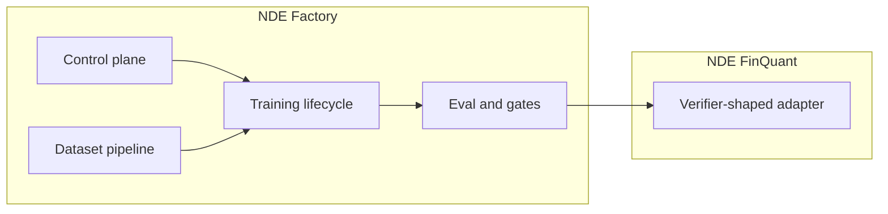

# NDE Factory — Architecture & terminology v0.1

**Status:** Normative framing for engineering and operators.  
**Scope:** Terminology, abstraction boundaries, and onboarding. **Does not** prescribe immediate code moves; implementation evolves in later milestones.

---

## 1. Definitions

### NDE — Narrow Domain Expert

An **NDE** is a **narrow-domain expert model**: an adapter (or equivalent artifact) trained and evaluated to behave reliably inside a **bounded mission** (verification, classification, guided reasoning within a domain contract) — **not** a general-purpose assistant.

### NDE Factory

The **NDE Factory** is the **reusable framework** for producing NDEs:

- Domain manifests and ingestion rules  
- Dataset generation and verification  
- Training lifecycle orchestration (eventually with orchestration/registry tooling)  
- Eval suites and **promotion gates**  
- Control-plane registry (runs, state, approvals)

The factory is **domain-agnostic**. Specific verticals plug in as **NDE: &lt;Domain&gt;** implementations.

### NDE: FinQuant

**FinQuant** is **not** “the whole system name.” It is the **first** factory implementation:

**NDE: FinQuant** — narrow quant-finance verifier aligned with FinQuant-1 architecture (`finquant/docs/FinQuant-1_architecture.md`).

### Future examples (illustrative)

| Name | Role |
|------|------|
| **NDE: VMware** | Narrow expertise for VMware ops/architecture patterns (hypothetical). |
| **NDE: Cloud** | Cloud provider vocabulary and well-architected checks (hypothetical). |
| **NDE: Security** | Policy/evidence-style verification in a security domain (hypothetical). |
| **NDE: DR** | Disaster-recovery runbooks and checklist reasoning (hypothetical). |
| **NDE: Codebase-specific assistant** | Repo-grounded narrow assistant bounded by verifier contracts (hypothetical). |

These are **naming and boundary examples**, not committed roadmap items.

---

## 2. How FinQuant maps to NDE Factory

| Factory concept | **NDE: FinQuant** concrete anchor (today) |
|-----------------|------------------------------------------|
| Domain root | `finquant/` tree + `domains/finquant/` descriptors |
| Source → staging | `finquant/training/source_to_training.py`, staging JSONL |
| Dataset proof | `finquant/scripts/dataset_proof.py` (as wired for FinQuant) |
| Training | `finquant/training/train_qlora.py`, `config_v0.1.yaml` |
| Eval | `finquant/evals/eval_finquant.py` |
| Control plane M1 | `finquant/control/finquantctl.py`, runs under `FINQUANT_BASE/runs/` |
| Architecture narrative | `finquant/docs/FinQuant-1_architecture.md` |

---

## 3. Reusable vs domain-specific

| Layer | **Reusable (factory)** | **Domain-specific (per NDE)** |
|-------|-------------------------|-------------------------------|
| Run registry, dry submit, status/list (M1 pattern) | ✓ | manifests paths / naming |
| “One run folder per job” discipline | ✓ | artifact filenames inside |
| Dataset hashing / manifest discipline | ✓ (pattern) | staging schema, **verifier contract** |
| QLoRA trainer invocation shape | ✓ (pattern) | **training defaults YAML**, loss/report semantics |
| Eval harness shell | ✓ (pattern) | **eval cases**, scoring thresholds |
| Promotion / approval gates | ✓ (concept) | **promotion criteria**, registry naming |
| VRAM / safety guards | ✓ | thresholds may vary |

---

## 4. Control plane responsibilities (factory-wide)

- **Identity:** run IDs, linkage between dataset version, config version, adapter version (design in `finquant/reports/training_control_plane_v0.1.md`).
- **Submission:** register intent without violating domain safety (M1: dry-only for FinQuant; see `finquant/reports/control_plane_m1_report.md`).
- **Observability:** logs directory per run, audit trail in `submit.json` / `run_state.json`.
- **Governance hooks:** future orchestration (Prefect/MLflow/DVC per design doc) **wrap** domain scripts rather than replacing them.

Domain modules supply **what** gets submitted (paths, modes); the factory supplies **how** runs are tracked.

---

## 5. Dataset pipeline responsibilities

Per domain, the factory expects:

1. **Source manifest rules** — what raw inputs are allowed and how they version.
2. **Deterministic staging** — reproducible JSONL (or agreed artifact) with content hashes.
3. **Verifier contract** — schema and behavioral expectations for training/eval rows.

For **NDE: FinQuant**, current logic lives under `finquant/training/` and related scripts; canonical specs evolve with FinQuant-1 docs.

---

## 6. Training lifecycle

**Conceptual stages** (factory-wide):

1. **Build / proof** dataset meets manifest and verifier contract.  
2. **Train** (smoke → full) with pinned configs and recorded hashes.  
3. **Eval** against domain eval suite.  
4. **Promote** only on passing gates + operator approval.

Concrete CLI/scripts for FinQuant are documented in `training_control_plane_v0.1.md` and implementation files under `finquant/training/`.

---

## 7. Eval and promotion gates

- **Eval:** domain-defined cases and pass/fail or score thresholds; output reports stored per run.
- **Promotion:** opt-in; requires eval success + **explicit approval** before any “production” routing or registry stage (per control-plane design).

Domain defines **what “good” means**; factory defines **how artifacts and approvals attach to runs**.

---

## 8. Domain module layout (`domains/<name>/`)

Each domain MUST eventually define (descriptors + code collocated when implemented):

| Obligation | Purpose |
|------------|---------|
| **Source manifest rules** | Allowed inputs, versioning, banned patterns |
| **Dataset generation extensions** | How staging rows are produced from sources |
| **Verifier contract** | Output schema / behavioral obligations for the NDE |
| **Eval cases** | Canonical tests for promotion consideration |
| **Training config defaults** | Base YAML / CLI defaults for smoke/full |
| **Promotion criteria** | Metrics thresholds + human gates |

Today, **`domains/finquant/`** holds README pointers to existing `finquant/` paths — **no mass refactor** until a planned migration milestone.

---

## 9. How to onboard a new domain

1. Create **`domains/<my_domain>/`** with README covering all six obligations above (stub acceptable).
2. Choose dataset staging layout and manifest hashing compatible with factory orchestration (follow FinQuant as reference).
3. Implement verifier contract as documented schemas + eval harness cases.
4. Add training defaults YAML and wire trainers analogously to `train_qlora.py` pattern (domain-specific script names acceptable).
5. Register control-plane experiment naming and promotion rules (`nde-<domain>-*` pattern recommended).
6. Run smoke → full → eval → promotion dry-run before production adapters.

---

## 10. Completion checklist for this document

| Deliverable | Location |
|-------------|----------|
| NDE / NDE Factory definitions | This document §1 |
| FinQuant as **NDE: FinQuant** | §2 |
| Reusable vs domain-specific | §3 |
| Control plane / dataset / lifecycle / eval gates | §§4–7 |
| Domain onboarding | §§8–9 |
| Domain stubs | `domains/README.md`, `domains/finquant/README.md` |

---

## 11. Required code changes (future) — evolve FinQuant into a full NDE Factory

**No code refactor in the milestone that introduced this doc.** When engineering is ready to **physicalize** the abstraction, plan work items such as:

1. **Extract factory core package** — shared run registry, IDs, and CLI substrate usable without importing FinQuant-specific modules (e.g. `nde_factory/` or `blackbox.nde_core`).
2. **Domain plug-in interface** — Python entry points or registry mapping `nde_name → module` for manifest validators, dataset builders, eval drivers.
3. **Relocate or symlink FinQuant implementation** — move FinQuant-specific scripts under `domains/finquant/` **or** keep `finquant/` and thin wrappers in `domains/finquant/` that delegate (minimal churn vs clarity tradeoff).
4. **Unify control plane** — parameterize `FINQUANT_BASE`-style paths to `NDE_BASE` / per-domain roots while preserving existing FinQuant host layout until migration window.
5. **Promote shared dataset primitives** — common hashing, JSONL validators, and proof scripts callable from any domain package.
6. **Split eval harness** — generic runner + domain plug-in for cases (FinQuant eval remains reference impl).
7. **CI and docs** — one factory doc set; per-domain READMEs and versioned `nde_factory_v0.x.md` updates.

This list is the **backlog for factory hardening**, not an immediate task list.

---

**Document path (canonical):** `finquant/reports/nde_factory_v0.1.md`
