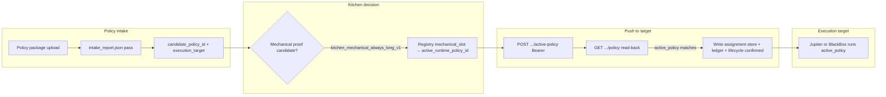
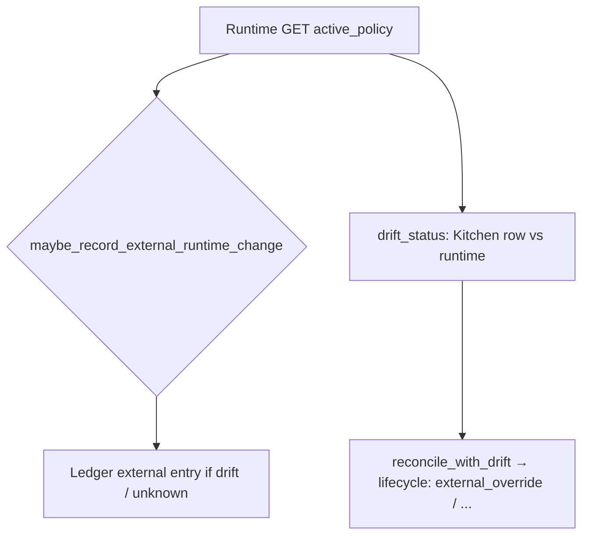

# Policy assignment systems map (Kitchen → runtime → reverse truth)

**Audience:** Architect, runtime ops, dashboard engineering  
**Scope:** How Quant Research Kitchen policy assignment is **designed** to work — **forward assignment** and **reverse assignment** together — which **Legos** (files, stores, APIs, env) connect, and **where friction shows up today**.  
**Status:** Living document — asks for a consolidated overview at the end.

---

## 1. What you are mapping

The assignment mechanism is **not** only “Kitchen pushes to the target.” It is **two coupled halves**:

| Half | Direction | What happens |
|------|-----------|----------------|
| **Forward assignment** | Kitchen → execution target | Operator runs the Kitchen assign path; BlackBox **POST**s `active-policy` to the target and **only then** persists assignment + ledger + lifecycle after **GET** read-back matches. |
| **Reverse assignment** | Trade surface / runtime → Kitchen | Passive poll (**GET** ``…/kitchen-runtime-assignment``) observes runtime vs persisted Kitchen row: **external** ledger entries, **drift**, **lifecycle** — **without** mutating the assignment store on GET. **Explicit** **POST** ``/api/v1/renaissance/runtime-policy-checkin`` (Bearer ``REN_RUNTIME_CHECKIN_TOKEN``) verifies live runtime and then reconciles the assignment store (rebind / unlink) so Kitchen becomes global truth after a trade-surface change. |

Both halves: forward establishes persisted intent; observation records external drift without pretending the store “became” the live policy unless the operator runs assign again successfully.

Two different “truths” exist in the system:

| Truth | Meaning |
|-------|---------|
| **Kitchen record** | What BlackBox persisted after an operator action from the Kitchen flow (`kitchen_runtime_assignment.json`). |
| **Runtime truth** | What the **execution target** reports as `active_policy` over HTTP (`GET …/policy`). |

**Design rule:** Kitchen assignment store is updated by (1) forward **assign** path (**POST** … **+** runtime GET verify) and (2) explicit **runtime policy check-in** after a trade-surface change (**POST** ``runtime-policy-checkin`` **+** verify live runtime matches reported policy **+** ``reconcile_assignment_store_to_runtime_truth``). Passive **GET** on the dashboard remains **observational only** — it does **not** overwrite the persisted assignment row. Until check-in or a successful forward assign, external changes surface as drift / lifecycle / ledger.

---

## 2. Glossary (Lego names)

- **Candidate** — A policy submission that passed intake (`intake_report.json` with `pass: true`, `candidate_policy_id`, etc.). Listed via candidates registry (DV-061).
- **Mechanical candidate** — The proof policy id `kitchen_mechanical_always_long_v1` mapped in `kitchen_policy_registry_v1.json` under `mechanical_slot.{jupiter|blackbox}` to a fixed **runtime policy id** (e.g. `jup_kitchen_mechanical_v1`). **Other** approved runtime ids (listed under `runtime_policies`) may also be assigned when intake `candidate_policy_id` matches that id (see `infer_runtime_policy_id_for_candidate`).
- **Execution target** — `jupiter` (Sean Jupiter stack) or `blackbox` (reserved BlackBox control plane). Normalized by `renaissance_v4/execution_targets.py`.
- **Kitchen policy registry** — `renaissance_v4/config/kitchen_policy_registry_v1.json`: allowed runtime policy ids per target + mechanical slot mapping (DV-074).
- **Assignment store** — `renaissance_v4/state/kitchen_runtime_assignment.json` (`kitchen_runtime_assignment_store_v1`).
- **Lifecycle store** — `renaissance_v4/state/kitchen_policy_lifecycle_v1.json` per `(submission_id, execution_target)` (DV-069).
- **Ledger** — Append-only history in `kitchen_policy_ledger` (Kitchen assigns + external drift).
- **Trade surface** — Operator-facing place where active policy can change **without** going through Kitchen (e.g. Jupiter web UI calling Sean’s `POST /api/v1/jupiter/active-policy`). After a local change, Jupiter should **POST** BlackBox ``/api/v1/renaissance/runtime-policy-checkin`` so Kitchen persists the same policy (optional **JUPITER_REQUIRE_KITCHEN_ACK** rolls SQLite back if check-in fails).
- **Reverse assignment / external change** — Passive ``GET …/kitchen-runtime-assignment`` **does not** mutate the assignment store. It runs runtime GET → `maybe_record_external_runtime_change` (ledger) → `drift_status` → `reconcile_with_drift` (lifecycle only). To **close the loop**, use **POST** ``runtime-policy-checkin`` (or the forward assign path). `reconcile_assignment_store_to_runtime_truth` is used by that check-in and by tests/tooling — **not** by passive dashboard GET polling.

---

## 3. Intended forward flow (candidate → Kitchen → target inherits)

This is the **happy path** when everything goes through Kitchen.

**Step-by-step (mechanical path, as implemented):**

1. **Intake succeeds** — `assign_mechanical_candidate` reads `renaissance_v4/policy_intake/submissions/{id}/report/intake_report.json` and requires `pass`, correct `candidate_policy_id`, and matching `execution_target`.
2. **Registry resolves slot** — `mechanical_slot_safe` + `runtime_policy_approved` ensure the target runtime policy id is listed in the registry.
3. **Outbound HTTP (Kitchen API host → target)** — For Jupiter: `POST {KITCHEN_JUPITER_CONTROL_BASE}/api/v1/jupiter/active-policy` with `{"policy": "<active_runtime_policy_id>"}` and Bearer token; then `GET …/jupiter/policy` to verify. BlackBox path mirrors with `KITCHEN_BLACKBOX_*` env vars.
4. **Persistence only after verify** — Local `assignments_by_target[et]` is written **only** if POST succeeds and GET read-back matches (DV-074). Ledger gets a `kitchen` entry; lifecycle moves toward `assigned_runtime_confirmed` via `mark_assigned_runtime_confirmed`.

**API surface (BlackBox `api_server.py`):**

- `GET /api/v1/renaissance/kitchen-runtime-assignment?execution_target=jupiter|blackbox` — Full read payload (assignment, `live_runtime_policy`, drift, `sync_state`, lifecycle summary, ledger tail; **does not** mutate the store).
- `POST /api/v1/renaissance/kitchen-runtime-assignment` — Body: `submission_id`, `execution_target`; runs `assign_mechanical_candidate`.
- `POST /api/v1/renaissance/runtime-policy-checkin` — Body: `execution_target`, `active_policy`, optional `change_source`; Bearer `REN_RUNTIME_CHECKIN_TOKEN`. Runs `apply_runtime_policy_checkin` (verify live runtime GET vs `active_policy`, then `reconcile_assignment_store_to_runtime_truth`). **401** if token missing/wrong; **503** if server token not configured.
- Legacy: `GET …/kitchen-jupiter-assignment` returns **410 Gone**; `POST …/kitchen-assign-jupiter` remains a deprecated alias; prefer `kitchen-runtime-assignment`.

**UI thread:** Dashboard renders **Active trade policy** from the Kitchen assignment row (`assignment.active_runtime_policy_id`) when set; live Jupiter id is in `live_runtime_policy` / `runtime` for drift and green-dot row match.

---

## 4. Reverse assignment (trade surface → Kitchen) and backwards compatibility

If the operator (or automation) changes active policy **on the trade surface**, Kitchen does **not** receive a webhook. **The next GET** records drift and lifecycle; it does **not** overwrite Kitchen’s persisted assignment row.

**Behaviors to remember:**

- **`authoritative_active_policy`** — Kitchen-assigned runtime policy id when an assignment row exists; otherwise falls back to live runtime (no assignment yet).
- **`live_runtime_policy`** — What the trade service reports; compare to assignment for override/drift. Assignment store is updated only via successful **POST** `assign_mechanical_candidate`, not via GET.
- **`unknown_runtime_policy`** — Runtime reports a policy id **not** in `kitchen_policy_registry_v1.json`; UI and drift treat this distinctly.
- **External ledger** — `maybe_record_external_runtime_change` dedupes ledger lines when runtime diverged from last Kitchen assignment without a new Kitchen POST.

**Optional** `reconcile_assignment_store_to_runtime_truth` (tests / explicit tooling only) may rewrite the store; it is **not** part of normal dashboard polling.

---

## 5. Data and control-plane threads (how things connect)

| Lego | Path / endpoint | Role |
|------|------------------|------|
| Registry | `renaissance_v4/config/kitchen_policy_registry_v1.json` | Allow-list + mechanical mapping; must stay aligned with Sean `ALLOWED_POLICY_IDS` (see registry `description`). |
| Assignment store | `renaissance_v4/state/kitchen_runtime_assignment.json` | Last successful Kitchen-driven assignment per target. |
| Lifecycle | `renaissance_v4/state/kitchen_policy_lifecycle_v1.json` | Per-submission state machine vs runtime drift. |
| Candidates API | `GET …/renaissance/ui/intake-candidates` (see `api_server`) | Rows enriched with `runtime_policy_id` for UI. |
| Jupiter control | Env: `KITCHEN_JUPITER_CONTROL_BASE`, `KITCHEN_JUPITER_OPERATOR_TOKEN` | Must point at **Sean Jupiter** origin, not BlackBox `:8080` (see `jupiter_control_plane_warnings`). |
| BlackBox control | `KITCHEN_BLACKBOX_CONTROL_BASE`, `KITCHEN_BLACKBOX_OPERATOR_TOKEN` | Parallel path for `blackbox` target. |

**Thread separation:** The **browser** talks to BlackBox (nginx → `api` :8080). **Kitchen assignment** code in `api` makes **outbound** HTTP to the **Jupiter** host/port where Sean’s policy API lives. Pointing `KITCHEN_JUPITER_CONTROL_BASE` at the wrong process is a common failure mode (documented in code).

---

## 6. Problems observed in practice (current pain)

These are **symptoms** seen when wiring the dashboard and lab; they are not an exhaustive root-cause analysis.

1. **Headline vs live** — The primary line should track **Kitchen assignment**; the green dot still reflects **live runtime vs row** (DV-077). When those differ, drift styling and status text should say override/drift, not “success” on the wrong id.

2. **Drift is normal** — Any change on the Jupiter trade surface creates **runtime_diverged** until a new successful Kitchen assign aligns live with intent. Operators may interpret drift as a bug unless copy is explicit.

3. **Registry vs runtime allow-list** — Assignment fails with `jupiter_runtime_policy_set_mismatch` if Sean’s `allowed_policies` does not include the mechanical slot id even when the repo registry lists it (DV-077). Deploy skew between Sean and BlackBox repo is a **hard** gate.

4. **Configuration sensitivity** — Wrong `KITCHEN_JUPITER_CONTROL_BASE` (e.g. localhost:8080) blocks or mis-assigns; warnings exist but depend on env being set correctly on the **API** host.

5. **Stale deploy** — Dashboard HTML and API code are served from the repo mount; static assets are baked in **web**. Partial updates (pull without rebuild/restart) can make the UI look “wrong” even when `main` is correct.

6. **Kitchen assign path** — `assign_mechanical_candidate` assigns any **passing** intake whose `candidate_policy_id` maps to an approved runtime id (`runtime_policies` or `mechanical_slot` in `kitchen_policy_registry_v1.json`). Unmapped ids (e.g. test-only `fixture_*` without a registry entry) cannot be pushed until the policy is listed and the runtime can load it.

---

## 7. Request for architect overview

We need a **single top-level narrative** that answers:

- How **forward assignment** and **reverse assignment** are jointly specified (not “push-only” semantics), including whether any future **push** from target to Kitchen is desired or pull-only is final.
- Where is the **activation boundary** between “evaluated in Kitchen” and “live on a target,” and how does that interact with **DV-028** (Kitchen-first, no direct load)?
- For **non-mechanical** policies, what is the **intended** end-state of this same assignment store vs a future unified state machine?
- Should **trade-surface** changes ever **push** identity back into Kitchen beyond reconcile + ledger (e.g. operator attribution), or is **runtime GET + audit** sufficient?
- What is the **canonical** operator story when `drift` is `runtime_diverged`: always fix from Kitchen, always fix from Jupiter, or either with ledger as source of history?

Please provide a short **architect overview** tied to this map so engineering can align UI copy, lifecycle names, and runbooks with one story.

---

## 8. Primary code references

| Topic | Module |
|-------|--------|
| Assignment + runtime query + drift + read payload | `renaissance_v4/kitchen_runtime_assignment.py` |
| Lifecycle states + drift reconciliation | `renaissance_v4/kitchen_policy_lifecycle.py` |
| Registry + `infer_runtime_policy_id_for_candidate` | `renaissance_v4/kitchen_policy_registry.py` |
| Candidate list + `runtime_policy_id` enrichment | `renaissance_v4/policy_intake/candidates_registry.py` |
| HTTP routes | `UIUX.Web/api_server.py` (`kitchen-runtime-assignment`, candidates, ledger) |

---

## 9. Related documents (repo)

- `docs/architect/DV-ARCH-POLICY-LOAD-028_unified_policy_submission.md` — product rule for Kitchen-first activation (full implementation still tracked).
- `renaissance_v4/kitchen_runtime_assignment.py` module docstring — DV-068 / DV-074 summary.
