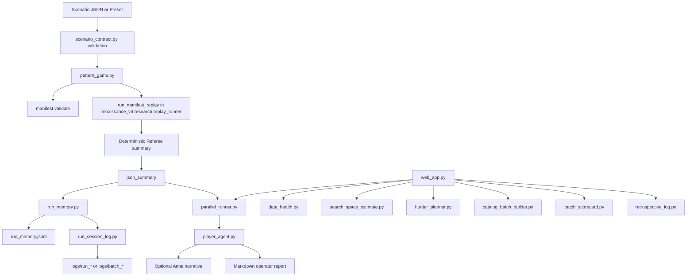

# GM Context Map

Date: 2026-04-18

## Purpose of this subproject

`renaissance_v4/game_theory` is a research harness for the BLACK BOX project.

Its purpose is to test a disciplined idea:

1. A human or agent proposes a candidate strategy or scenario.
2. A deterministic replay engine evaluates it on historical market data.
3. The system records what was tried, what changed, and what happened.
4. Optional agent or LLM layers may explain, organize, and suggest next experiments, but they do not score outcomes.

The subproject is therefore a governed pattern-discovery lab, not a live trading runtime.

## Primary goal

The real goal is not "find one run with positive PnL."

The goal is to discover repeatable pattern-to-policy matches that survive replay under fixed rules, with enough structure that the team can:

- compare candidates honestly
- preserve experiment memory
- explain why a candidate was tried
- keep LLM reasoning separate from deterministic truth
- promote only reviewable, governed outputs later

This intent is stated most clearly in:

- `README.md`
- `GAME_SPEC_INDICATOR_PATTERN_V1.md`
- `QUANT_RESEARCH_AGENT_DESIGN.md`
- `TEAM_BRIEF_PATTERN_GAME_AGENT.md`
- `shared_mind_multi_agent_architecture.md`

## What this subproject is not

This folder is not a live execution engine, not a production trading bot, and not a place where an LLM is allowed to invent market outcomes.

Hard boundaries expressed across the docs and code:

- Referee scores come only from deterministic replay.
- LLM output is advisory, not authoritative.
- Memory logs do not automatically alter execution.
- Execution can change only through explicit manifest changes, scenario overrides, or an allowed memory bundle merge.
- The folder currently supports research and operator workflow, not autonomous market action.

## High-level architecture

## Core runtime layers

### 1. Deterministic truth layer

This is the most important boundary in the folder.

Files:

- `pattern_game.py`
- `MANIFEST_REPLAY_INTEGRATION.md`

External dependencies outside this folder:

- `renaissance_v4.manifest.validate`
- `renaissance_v4.research.replay_runner.run_manifest_replay`
- strategy manifest files under `renaissance_v4/configs/manifests/`
- the registry and policy vocabulary in the broader `renaissance_v4` tree

Responsibilities:

- load a manifest
- optionally merge a whitelisted memory bundle
- optionally apply ATR stop/target overrides
- validate the effective manifest against the catalog
- call deterministic historical replay
- convert replay outcomes into the pattern-game summary shape

Important boundary:

- `pattern_game.py` is the official scored path in this folder
- it does not let LLM text inject outcomes
- binary win/loss scoring is derived from replay outcomes only

### 2. Parallel experiment orchestration layer

Files:

- `parallel_runner.py`
- `scenario_contract.py`

Responsibilities:

- validate or normalize scenario rows
- run many scenarios in a process pool
- keep worker payloads JSON-safe
- copy only whitelisted audit metadata into results
- write optional experience logs, run memory, and session folders

Important boundary:

- `parallel_runner.py` scales deterministic replay
- it does not redefine replay rules
- scenario metadata such as `tier`, `evaluation_window`, `training_trace_id`, and `agent_explanation` are echoed for audit, not used for scoring

### 3. Player and facade layer

Files:

- `player_agent.py`
- `pattern_game_agent.py`
- `__init__.py`

Responsibilities:

- fill missing `agent_explanation` blocks
- produce markdown operator reports from Referee facts
- optionally call Anna for narrative help
- provide a clean application-facing facade via `PatternGameAgent`

Important boundary:

- `player_agent.py` helps runs explain themselves
- it still delegates actual scoring to `run_scenarios_parallel()` and the underlying Referee path
- `PatternGameAgent` is the integration seam for host apps and services

### 4. Memory, audit, and experiment history layer

Files:

- `run_memory.py`
- `run_session_log.py`
- `memory_paths.py`
- `memory_bundle.py`
- `groundhog_memory.py`
- `batch_scorecard.py`
- `retrospective_log.py`
- `agent_reflect_bundle.py`
- `hunter_planner.py`
- `context_memory.py`

Responsibilities:

- write structured JSONL records for runs
- create human-readable per-run and per-batch folders
- preserve experiment hypotheses and indicator context
- keep batch-level scorecards and operator retrospectives
- generate deterministic next-batch suggestions from prior runs
- define how "memory" may or may not affect future execution

Important boundaries:

- `run_memory.jsonl`, session folders, and retrospectives are audit artifacts; they do not auto-steer replay behavior
- only `memory_bundle.py` and `groundhog_memory.py` define approved "memory changes execution" behavior
- even there, only whitelisted keys currently apply: `atr_stop_mult` and `atr_target_mult`

### 5. Operator surface and local tooling layer

Files:

- `web_app.py`
- `data_health.py`
- `search_space_estimate.py`
- `catalog_batch_builder.py`
- `requirements.txt`

Responsibilities:

- provide a local Flask UI for presets, pasted JSON, and parallel runs
- show database health and available data span
- expose search-space and workload estimates
- generate valid ATR sweep batches
- record progress and batch timing

Important boundary:

- the web UI is an operator shell around the same core engine
- it does not define separate scoring rules
- it consumes the same scenario contract and deterministic replay path as scripts

### 6. Anna perception and prompt-guard layer

Files:

- `anna_hard_rules.py`
- `anna_visible_window.py`

Responsibilities:

- constrain what Anna is allowed to claim
- define the visible-window contract
- reinforce that Anna sees only a short OHLCV slice plus documentation and memory tails

Important boundary:

- Anna must not act as if she observed the entire replay tape
- Anna must not invent scores
- Anna is advisory only

## Practical repo map beyond `game_theory`

This section is the broader repo-level view that helps place the `game_theory` subproject inside the BLACK BOX tree.

The framing below is intentionally practical:

- applications
- modules
- sub-modules
- what is actually implemented in this repo

### 1. Operator and web applications

These are the user-facing or operator-facing surfaces currently visible in the repo.

| Application | Role | Verified locations |
|-------------|------|--------------------|
| Pattern game lab | Local preset/paste scenario UI, parallel replay, scorecard, progress polling | `renaissance_v4/game_theory/web_app.py`, `pattern_game.py`, `parallel_runner.py` |
| Black Box dashboard / web shell | Operator-facing web surface served from `UIUX.Web/` | `UIUX.Web/api_server.py`, `UIUX.Web/dashboard.html`, `UIUX.Web/docker-compose.yml` |
| UI / control-plane APIs | Read-only and governed job payloads, status, policy control hooks | `renaissance_v4/ui_api.py`, `renaissance_v4/ui_jobs.py`, `renaissance_v4/blackbox_policy_control_plane.py` |

Fit with `game_theory`:

- `game_theory/web_app.py` is the focused lab application
- `UIUX.Web/` and `renaissance_v4/ui_api.py` sit at the broader product/operator layer
- the lab is one application surface, not the whole operator stack

### 2. Pattern game stack

This is the subproject mapped in more detail earlier in this document. In practical repo terms:

| Module | Sub-modules | Verified role |
|--------|-------------|---------------|
| Replay / Referee | `pattern_game.py`, `scenario_contract.py`, `parallel_runner.py` | Deterministic replay orchestration and scored run flow |
| Batch memory / history | `batch_scorecard.py`, `run_session_log.py`, `run_memory.py` | JSONL logs, per-batch history, human-readable run folders |
| Operator memory | `retrospective_log.py`, `hunter_planner.py`, `agent_reflect_bundle.py` | Remember what was tried, suggest next batches |
| Context / bundle layer | `context_memory.py`, `memory_bundle.py`, `memory_paths.py` | Define context quality, memory bundle merge points, storage roots |
| Groundhog continuity | `groundhog_memory.py` | Optional canonical bundle reuse between runs |
| Search / build helpers | `catalog_batch_builder.py`, `search_space_estimate.py` | Build ATR sweeps and estimate workload/search size |
| Data / health | `data_health.py` | Validate DB, table, row counts, and SOLUSDT span |
| Agent / governance guard layer | `player_agent.py`, `pattern_game_agent.py`, `anna_hard_rules.py`, `anna_visible_window.py` | Narrative/helpful layers and prompt boundaries |
| Web UI | `web_app.py` | Operator-facing Flask interface around the same core engine |

### 3. Renaissance engine under the pattern game

The pattern game is built on top of the broader Renaissance engine.

| Engine area | Verified sub-modules | Role |
|-------------|----------------------|------|
| Market / features | `renaissance_v4/core/market_state_builder.py`, `feature_engine.py`, `regime_classifier.py` | Convert bar data into state, features, and regimes |
| Signals | `renaissance_v4/signals/trend_continuation.py`, `pullback_continuation.py`, `breakout_expansion.py`, `mean_reversion_fade.py` | Signal modules referenced by manifests |
| Fusion / decision | `renaissance_v4/core/fusion_engine.py`, `risk_governor.py`, `portfolio_manager.py`, `execution_manager.py` | Decision fusion, risk, portfolio handling, execution logic in replay |
| Manifest / registry / policy vocabulary | `renaissance_v4/manifest/`, `renaissance_v4/registry/`, `renaissance_v4/policy_spec/` | Define what valid strategies and policies look like |
| Research analytics | `renaissance_v4/research/replay_runner.py`, `learning_ledger.py`, `diagnostic_*.py`, `walk_forward.py`, `monte_carlo.py`, `promotion_recommender.py` | Experimental analysis and replay-adjacent research tooling |

Fit with `game_theory`:

- `game_theory` does not replace this engine
- it is a governed research harness around this engine
- the most important dependency is `renaissance_v4.research.replay_runner`

### 4. Data application layer

| Module | Verified sub-modules | Role |
|--------|----------------------|------|
| SQLite / bar data | `renaissance_v4/data/init_db.py`, `init_schema.py`, `bar_validator.py`, `seed_smoke_bars.py` | Initialize, validate, and seed local replay data |
| External ingest | `renaissance_v4/data/binance_ingest.py` | Ingest market bars into the local DB |

Fit with `game_theory`:

- the lab depends on the data layer being present and healthy
- `data_health.py` is the bridge from lab UI to this lower data layer

### 5. Policy / kitchen / governance surfaces

This is the broader governed promotion and intake area adjacent to the lab.

| Area | Verified sub-modules | Notes |
|------|----------------------|-------|
| Policy intake | `renaissance_v4/policy_intake/` including `pipeline.py`, `promote_runtime.py`, `ts_validate.py`, `kitchen_policy_manifest.py` | Intake and validation pipeline for policy material |
| Kitchen policy lifecycle and inventory | `renaissance_v4/kitchen_policy_ledger.py`, `kitchen_policy_inventory.py`, `kitchen_policy_lifecycle.py`, `kitchen_policy_registry.py` | Policy bookkeeping and lifecycle tracking |
| Promotion and control | `renaissance_v4/core/promotion_engine.py`, `renaissance_v4/blackbox_policy_control_plane.py`, `renaissance_v4/research/promotion_recommender.py` | Promotion mechanics, control-plane hooks, recommendation logic |

Important correction:

- there is no top-level `renaissance_v4/promotion_engine.py` in this tree
- the promotion engine present in the repo is `renaissance_v4/core/promotion_engine.py`

Fit with `game_theory`:

- the lab compares manifests and produces evidence
- governed policy intake and promotion live in adjacent layers
- `game_theory` is not itself the final promotion engine

### 6. Agents in the repo

| Area | Verified locations | Notes |
|------|--------------------|-------|
| Cody runtime | `agents/cody/`, `agents/cody/runtime/` | Active Cody implementation artifacts are present |
| Data agent area | `agents/data/` | Data agent docs and skills are present |
| Future trading/runtime agents | Repo docs mention Billy and Jack, but this tree does not present them here as a full active runtime in Phase 1 | Matches the repo-level `AGENTS.md` constraints |

Fit with `game_theory`:

- `game_theory` acts like a research lab and agent-facing experiment harness
- it is not itself the full multi-agent execution system

### 7. Where "machine learning" actually lives in this repo

This deserves precise wording.

There is no single "ML on/off" switch that governs the whole Renaissance engine.

The repo currently mixes three different categories that people may loosely call ML:

| Category | Where it appears | Better label |
|----------|------------------|--------------|
| Deterministic market engine | `core/`, `signals/`, manifest-driven replay | Feature / signal / fusion engine, not generic ML |
| Research analytics and experiment tooling | `renaissance_v4/research/` | Research / diagnostics / learning-adjacent analytics |
| Optional Anna training and heavy math stack | Root `README.md` references `math-engine-full`, scientific deps, `scikit-learn`, optional Anna analysis facts | Optional Anna math / training stack, not the default pattern-game core |

Verified note from repo docs:

- the root `README.md` explicitly calls out the optional `math-engine-full` path and heavy dependencies such as `numpy`, `pandas`, `scipy`, `statsmodels`, `arch`, and `scikit-learn`
- that path is associated with Anna training / analysis support, not the narrow deterministic Referee loop in `game_theory`

Bottom-line naming guidance:

- do not label the whole engine "ML"
- distinguish deterministic replay engine, research analytics, and optional Anna math/training stack

## Document and code relationships

### Normative design docs

- `GAME_SPEC_INDICATOR_PATTERN_V1.md`
  - defines the game, Referee and Player roles, scoring intent, and player prohibitions
- `QUANT_RESEARCH_AGENT_DESIGN.md`
  - explains the larger research philosophy: pattern discovery over one-off profit
- `TEAM_BRIEF_PATTERN_GAME_AGENT.md`
  - explains the stack to operators and integrators
- `MANIFEST_REPLAY_INTEGRATION.md`
  - explains how the replay path was made manifest-driven
- `shared_mind_multi_agent_architecture.md`
  - future-facing architecture for a larger shared-mind multi-agent system
- `agent_artifacts.md`
  - reserved artifact types for future strategy research agent tooling

### Source modules

The code follows the docs reasonably well:

- `pattern_game.py` implements the scored Referee entry point described by the spec
- `parallel_runner.py` and `scenario_contract.py` implement batch execution and audit metadata echoing
- `player_agent.py` implements the "player/orchestrator" explanation layer described in the docs
- `run_memory.py`, `run_session_log.py`, `batch_scorecard.py`, and `retrospective_log.py` implement durable experiment memory
- `web_app.py` wraps the system in a local operator UI

### Example assets

Files under `examples/` show intended usage patterns:

- baseline and ATR comparison batches
- Tier-1 scenario templates
- agent-trace examples
- width/depth search examples
- memory bundle examples

These are important because they encode the practical scenario contract the rest of the tooling expects.

## Boundaries inside the subproject

### Boundary A: scored truth vs narrative

Scored truth:

- `pattern_game.py`
- `parallel_runner.py`
- deterministic replay in `renaissance_v4.research.replay_runner`

Narrative and operator aid:

- `player_agent.py`
- Anna prompt helpers
- human-readable log rendering
- retrospective notes

Rule:

- narrative may summarize scored outcomes
- narrative may not replace them

### Boundary B: metadata vs execution inputs

Metadata only:

- `scenario_id`
- `tier`
- `evaluation_window`
- `training_trace_id`
- `prior_scenario_id`
- most of `agent_explanation`

Execution-changing inputs:

- manifest contents
- explicit ATR overrides
- memory bundles merged through approved paths

Rule:

- scenario metadata helps auditability and curriculum
- only explicit execution inputs are allowed to alter replay behavior

### Boundary C: present implementation vs future architecture

Implemented now:

- manifest validation
- deterministic replay integration
- scenario batch execution
- run/session logging
- local web UI
- optional Anna narration
- deterministic suggestion helpers

Reserved or future-facing:

- full strategy research agent artifact workflow
- richer pattern memory beyond JSONL
- broader multi-agent shared-mind runtime
- mature context-rich indicator traces on decision bars
- promotion into formal JUP policy packages

## External dependencies and seams

This folder depends on important components outside itself.

### Replay and policy infrastructure

- `renaissance_v4.research.replay_runner`
- `renaissance_v4.manifest.validate`
- `renaissance_v4/registry/catalog_v1.json`
- `renaissance_v4/configs/manifests/*.json`

This means `game_theory` is not a fully standalone engine. It is a research shell built on top of the broader Renaissance replay and manifest stack.

### Data boundary

- SQLite database path from `renaissance_v4.utils.db.DB_PATH`
- expected table: `market_bars_5m`
- primary instrument in the spec and checks: `SOLUSDT`

### LLM boundary

- `scripts/agent_context_bundle.py`
- `scripts/runtime/_ollama.py`
- `llm.local_llm_client.ollama_generate`

This keeps LLM integration outside the scoring core.

## Current maturity of the subproject

Based on the checked-in logs and JSONL artifacts, the subproject is structurally ahead of it being empirically mature.

What appears mature:

- the architectural intent
- the separation between deterministic truth and agent assistance
- batch orchestration
- audit and session logging
- web operator workflow
- bounded memory mechanics

What appears immature or still in smoke-test mode:

- the actual replay evidence base in this folder
- the current logged data mostly shows the same baseline manifest on a 60-bar lab dataset
- the recorded runs currently converge to the same checksum and zero trades / zero PnL
- retrospective memory is designed but not yet populated in-tree
- structured `indicator_context` is emphasized heavily, but most recorded runs have it missing

This means the folder already demonstrates a serious research operating model, but it does not yet demonstrate that meaningful market edge has been discovered here.

## Generated artifacts vs source of truth

### Source of truth

- markdown design docs
- python source files
- example JSON presets

### Generated artifacts

- `logs/`
- `experience_log.jsonl`
- `run_memory.jsonl`
- `batch_scorecard.jsonl`
- `retrospective_log.jsonl` when present
- `__pycache__/`

Generated artifacts are useful evidence and audit output, but they are not the normative design definition of the system.

## Practical reading order for a new contributor

If someone needs to understand this subproject quickly, the best reading order is:

1. `README.md`
2. `GAME_SPEC_INDICATOR_PATTERN_V1.md`
3. `QUANT_RESEARCH_AGENT_DESIGN.md`
4. `pattern_game.py`
5. `parallel_runner.py`
6. `player_agent.py`
7. `run_memory.py`
8. `run_session_log.py`
9. `web_app.py`
10. `examples/`

## Bottom line

The subproject is a controlled research environment for discovering and comparing replay-validated market patterns.

Its defining design principle is:

- the system may propose with agents
- the system may remember with logs and bounded memory bundles
- the system may explain with markdown and Anna
- but the system proves nothing except through deterministic replay

That is the central relationship, boundary, and purpose that the rest of the folder is built around.
