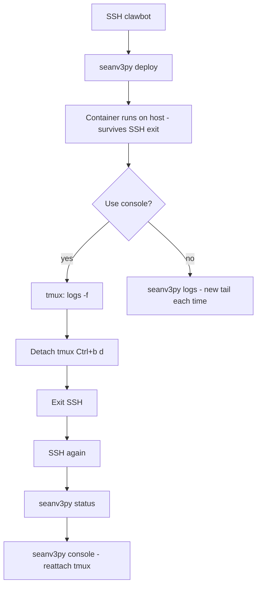

# seanv3py — Sean V3 Docker (end-to-end helper)

**`seanv3py`** (and optional **`seanv3.py`**) live next to `docker-compose.yml` so you can manage the **Sean V3** parity container (`seanv3`) from one entrypoint.

It does **not** replace **`README.md`** or **`VPN/README.md`** — the stack still **must** use **`network_mode: host`** for Binance via Proton on clawbot.

---

## Process (emulates “run → disconnect SSH → come back → still up → same log workspace”)

This is the operator workflow that matches that intent.

| Step | Action | What persists |
|------|--------|-----------------|
| 1 | `ssh` to **clawbot** | — |
| 2 | `cd ~/blackbox/vscode-test/seanv3` | — |
| 3 | `./seanv3py deploy --pull` (or `deploy`) | **Docker** starts **`seanv3`** on the **host** (`docker compose up -d`). |
| 4 | `./seanv3py status` | Confirm **Up** (optional but good hygiene). |
| 5 | `./seanv3py console` | Opens **tmux** session `seanv3` running `docker compose logs -f` (needs **`tmux`** installed). |
| 6 | **Detach** from tmux: `Ctrl+b`, then **`d`** | Log stream **keeps running inside tmux** on the server. |
| 7 | **Close SSH** (exit) | **Container still running.** tmux session **still running** on clawbot. |
| 8 | Later: **SSH in again**, `cd` to same dir | New SSH session (normal). |
| 9 | `./seanv3py status` | Confirms container **still Up** — answers “is it already running?” **Yes**, if you didn’t `stop`. |
| 10 | `./seanv3py console` | **Reattaches** to the **same tmux session** — same log workspace as before. |

If you **don’t** use **`console`**, use **`logs`** after reconnect; each run is a new tail, but **Docker** state is unchanged.



### What is *not* possible

- **SSH** does **not** resume the old TCP session — each login is **new**. That’s normal.
- **“Same session”** here means: **tmux** on **clawbot** holds the **terminal workspace**; **Docker** holds the **app**.

---

## Requirements

- **Docker** + **Docker Compose** on the host.
- **`tmux`** for **`console`** (e.g. `sudo apt install tmux` on Debian).

## Location

| Item | Path |
|------|------|
| Shell entrypoint | `vscode-test/seanv3/seanv3py` |
| Python wrapper (same commands) | `vscode-test/seanv3/seanv3.py` |
| Compose | `vscode-test/seanv3/docker-compose.yml` |

## Make executable (once)

```bash
chmod +x ~/blackbox/vscode-test/seanv3/seanv3py ~/blackbox/vscode-test/seanv3/seanv3.py
```

Use either:

```bash
./seanv3py status
python3 seanv3.py status
```

## Commands

| Command | What it does |
|---------|----------------|
| `./seanv3py deploy` | `docker compose build` then `up -d` — container **keeps running** after you close SSH. |
| `./seanv3py deploy --pull` | `git pull origin main` at **repo root**, then deploy. |
| `./seanv3py status` | `docker compose ps` — see if **seanv3** is **Up**. |
| `./seanv3py logs` | `docker compose logs -f` — follow logs; **Ctrl+C** stops **tailing** only, not the container. |
| `./seanv3py console` | **tmux**: create or **reattach** to session `seanv3` (name via `SEANV3_TMUX_SESSION`) running `docker compose logs -f`. |
| `./seanv3py stop` | `docker compose down` — stops the stack. |
| `./seanv3py restart` | `down`, then `build` + `up -d`. |
| `./seanv3py restart --pull` | `down`, `git pull`, then `build` + `up -d`. |
| `./seanv3py pull` | `git pull origin main` only (repo root). |
| `./seanv3py preflight` | Automated checks: Binance ping + klines, `network_mode: host` in compose, `capture/` writable, optional SQLite + keypair JSON. |
| `./seanv3py preflight --require-container` | Same, plus **`seanv3`** container must be **running** and prints last log lines. |

---

## Pre-flight checklist (before you rely on parity / “paper” run)

**Order:** run **host routing + API** checks first, then **deploy**, then **container + DB** checks. This stack is **`PAPER_TRADING=1`** in `docker-compose.yml` — it records parity data; it does **not** place live exchange orders. Real execution lives elsewhere in Blackbox when that phase is enabled.

| # | Check | Why |
|---|--------|-----|
| 1 | **WireGuard / Binance path** on the host (see **`VPN/README.md`**) | Wrong egress often yields **HTTP 451** from Binance, not an app bug. |
| 2 | **Binance `/api/v3/ping` → 200** | Confirms HTTPS + API reachability from **this host**. |
| 3 | **Binance `/api/v3/klines` (SOLUSDT 5m)** → 200 + JSON array | Same path the poller uses; catches CDN/geo issues early. |
| 4 | **`docker-compose.yml` has `network_mode: host`** | Required so the container uses **host** routing (Proton split-tunnel). |
| 5 | **`capture/` writable** | NDJSON + SQLite bind-mount must be writable. |
| 6 | **SQLite `sean_parity.db`** (after first poll) | Table **`sean_binance_kline_poll`** should exist; compare vs Blackbox via **`jup_v3_parity_compare`** when you need alignment proof. |
| 7 | **Wallet** (`capture/keypair.json` + **`KEYPAIR_PATH`** in compose if you want pubkey in DB) | Optional for parity; invalid JSON should fail preflight if the file exists. |
| 8 | **Container up** + logs show **`ok`: true** (no 451) | Use `./seanv3py preflight --require-container` after **`deploy`**. |

**Automated:** `./seanv3py preflight` (host + compose + capture + optional DB/keypair). After **`deploy`**, run **`./seanv3py preflight --require-container`**.

**Not in the script (operator judgment):** disk space on `capture/`, clock skew, Blackbox **`market_data`** DB path for parity scripts, and any org-specific approvals before “trading” outside this container.

## Environment

| Variable | Meaning |
|----------|---------|
| `BLACKBOX_REPO` | If set, **`git pull`** uses this directory as the repo root. |
| `SEANV3_TMUX_SESSION` | tmux session name for **`console`** (default: `seanv3`). |

## Related docs

- **`README.md`** (this folder) — Sean V3 purpose, VPN table, capture paths.
- **`VPN/README.md`** (repo root) — WireGuard / Binance split-tunnel.
- **`../README.md`** — vscode-test index.
